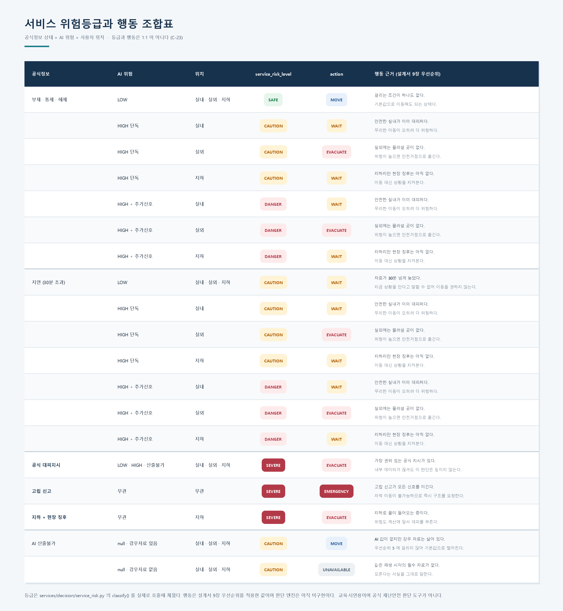
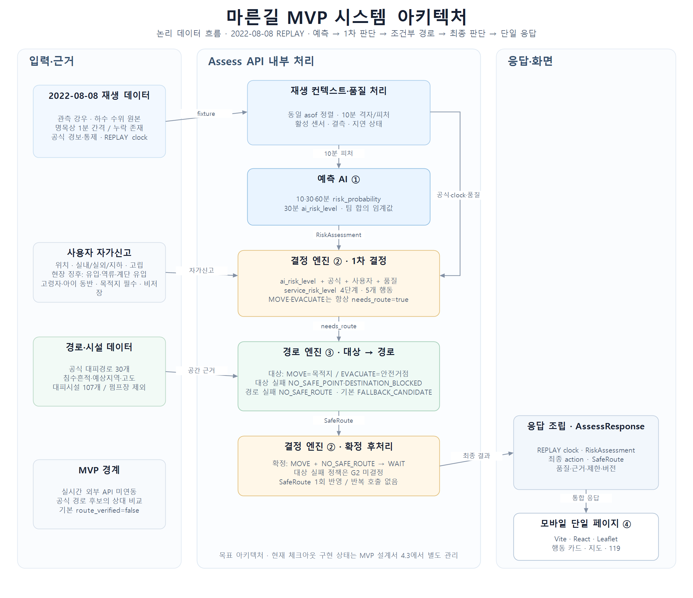
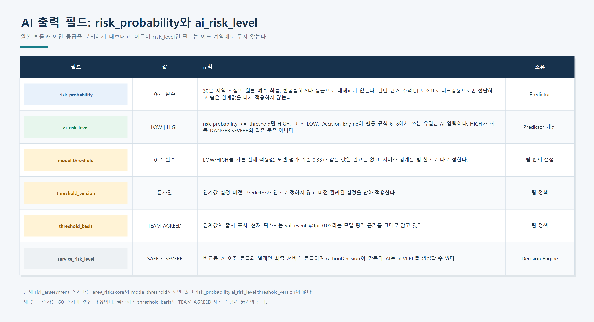
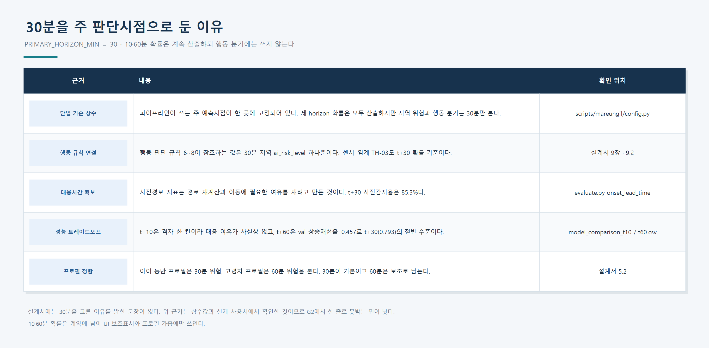
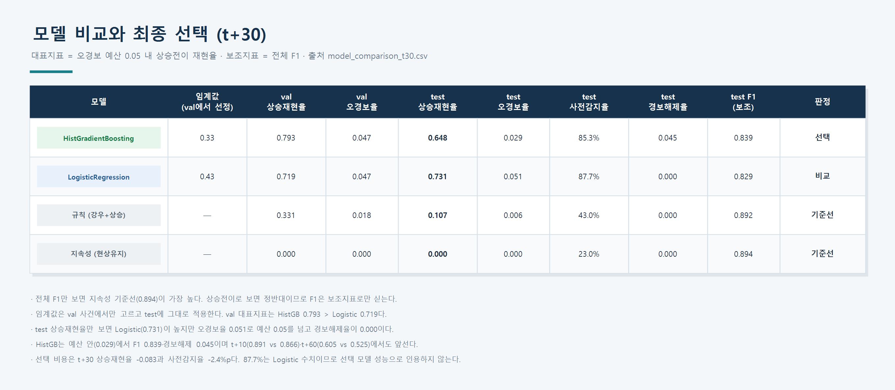
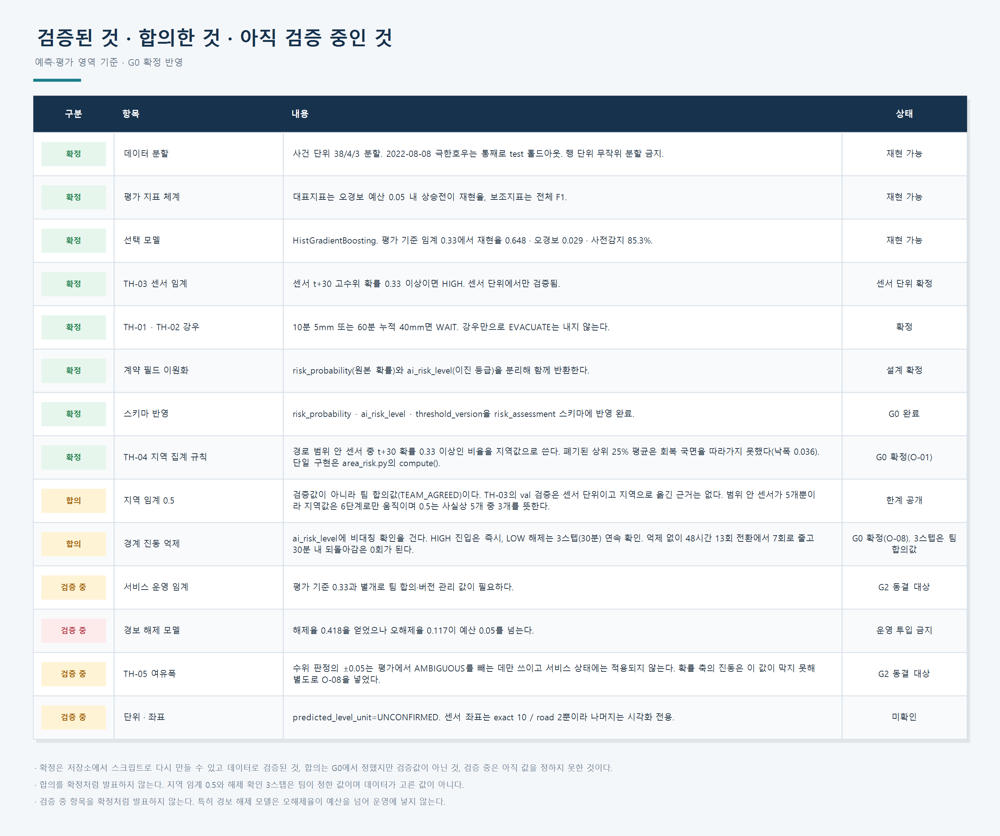
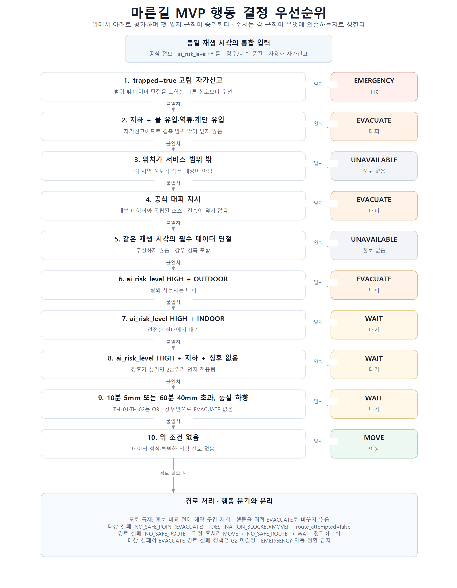

# 마른길 MVP 설계서

> 문서 버전: rev.5 · 계약 명명·경로 실패 단계 정리본  
> 기준일: 2026-08-11  
> 대상: 2026-08-12 준비일 + 30시간 온라인 해커톤  
> 상태: 목표 설계. 현재 저장소 구현 상태는 4절에서 별도로 표시한다.

## 1. 한 문장 정의

마른길은 2022년 8월 8일 강남 집중호우를 재생해, 사용자가 침수 상황에서 **지금 위험한가**와 **지금 무엇을 해야 하는가**를 한 화면에서 확인하는 모바일 웹 MVP다.

본 MVP는 교육·시연용이며 공식 재난안전 판단 도구가 아니다. 이 고지는 화면에 항상 노출한다.

## 2. 팀이 공유할 단일 기준

| 항목 | 확정 기준 |
|---|---|
| 실행 모드 | `clock.mode=REPLAY`인 2022-08-08 과거 상황 재생만 지원 |
| 화면 | Vite + React + Leaflet 기반 모바일 단일 페이지 |
| 예측 | 센서별 10·30·60분 고수위 확률을 유지하고, 30분 지역 위험에 대해 `risk_probability`와 `ai_risk_level=LOW/HIGH`를 함께 반환 |
| 하수 데이터 주기 | 원본은 **명목상 1분 간격의 과거 기록**이며 통신두절 구간이 존재. 모델 입력은 10분 집계·완전격자·품질검사를 거침 |
| 위험 등급 | `SAFE`, `CAUTION`, `DANGER`, `SEVERE` |
| 행동 | `MOVE`, `WAIT`, `EVACUATE`, `EMERGENCY`, `UNAVAILABLE` |
| 경로 | 현재 기본은 공식 대피경로 30개 후보의 상대 비교. `route_verified=false` |
| 경로 도달 대상 | `MOVE`는 사용자가 고른 목적지(`USER_DESTINATION`), `EVACUATE`는 서비스가 고른 안전거점(`SAFE_POINT`). 후보 집합은 동일 |
| 목적지 | 경로 범위 내 지정 지점 목록에서 **필수 선택**. 미선택 상태를 두지 않음 |
| 공식 정보 | 위험도의 하한선. AI가 높일 수는 있어도 낮출 수 없음 |
| 사용자 프로필 | MVP는 고령자·아이 동반만 지원. 선택·복수선택·비저장·자가신고이며 안전 기준을 낮추지 않음 |
| 긴급 연락 | 119만 사용. 자동 신고·자동 위치 전송 없음 |
| 시나리오 명칭 | 모델 픽스처는 `RF-*`, 통합 데모는 `DS-*`로 구분 |
| 구현 주장 | 계획서의 보고 상태와 현재 체크아웃에서 확인한 상태를 구분 |

### 2.1 근거 우선순위

상충 시 다음 순서로 판단한다.

1. 재현 가능한 데이터 산출물과 현재 계약 스키마
2. 「MVP Specification rev.1」의 제품·계약 기준
3. 「기술리드 배포판 rev.5」의 구현 계획·게이트 기준
4. 「온라인 해커톤 1일차 회의 자료」의 설명·업무 배치

회의 자료의 수치가 상위 근거와 다르면 상위 근거를 사용하고, 변경 사유는 [문서 정합성 평가서](./마른길_문서_정합성_평가.md)에 남긴다.

## 3. 목표와 성공 조건

### 3.1 목표

- 첫 화면에서 현재 위험 등급, 위치, 권고 행동, 재생 시각, 119 접근을 즉시 제공한다.
- AI 예측, 공식 정보, 사용자 상태, 데이터 품질을 분리해 설명한다.
- 공식 대피경로 후보를 과장 없이 보여주고 안전 경로로 단정하지 않는다.
- 동일 입력·동일 픽스처에서 동일 결과가 나오도록 재현한다.

### 3.2 데모 성공 조건

- `DS-S1`부터 `DS-S6`까지 행동 전이가 계약 enum으로 재현된다.
- `MOVE`는 목적지, `EVACUATE`는 안전거점을 도달 대상으로 삼는 구분이 `route_target`으로 재현된다.
- 대상 단계 실패와 경로 단계 실패가 `route_attempted`로 구분된다.
- `P1` 고령자와 `P2` 아이 동반 프로필이 최소 수용 범위로 동작한다.
- 데이터 지연·결측, 공식 정보 우선, 경로 실패 상태 분리와 확정된 후처리가 테스트된다.
- 흑백 화면에서도 위험 상태와 행동을 구분할 수 있다.
- UI에는 `clock.label`이 그대로 표시되며 브라우저 현재시각을 사용하지 않는다.

## 4. 범위와 현재 상태

### 4.1 MVP 포함 범위

- 2022-08-08 강남 집중호우 재생
- 강남 21개 + 서초 14개, 총 35개 센서 레지스트리
- 활성 센서별 10·30·60분 고수위 확률과 30분 지역 위험 `LOW/HIGH`
- 공식 정보·팀 정책·사용자 상태를 결합한 행동 결정
- 공식 대피경로 30개 후보의 상대 위험 비교
- 경로 범위 내 지정 지점 목록에서 고르는 **필수** 목적지 입력과 목적지 기준 `MOVE` 경로
- 대피시설, 공식 통제, 예측 영역, 침수흔적 지도 레이어
- 상황 및 고령자·아이 동반 프로필 자가신고
- 119 전화 연결과 위치 문구 복사

### 4.2 제외 범위

- 실시간 외부 API 연동과 현재 시각 예보
- 로그인, 설정, 이력, 온보딩, 사용자 추적·저장
- 도로 침수 여부의 직접 예측
- 하수 수위의 m·cm·관경 대비 충만율 표시
- 현재 기본 경로의 안전·최적·검증 완료 주장
- 자유 텍스트 검색·자유 좌표 목적지 입력, 경로 범위 밖 목적지, 목적지 미선택 상태
- 휠체어·반려동물 동반 프로필 지원(검증 데이터 부족으로 MVP 제외)
- 자동 119 신고 또는 자동 위치 전송
- 실시간 내비게이션과 운영 관제
- **분 단위 급변 감시규칙** — 붙이지 않기로 확정했다 (M-06)
- **조기 고립 예측** — 도로정보와 정답 라벨이 부족해 후속 연구로 분리한다. 이번 MVP는
  사용자가 실제 고립 상태를 신고한 경우 `trapped=true → EMERGENCY` 규칙만 적용한다 (M-19).
  후속 연구에서는 시간에 따른 공식 통제·확인 침수구간·대피경로 변화·시설 이용 가능 상태와
  실제 고립 여부 정답 데이터를 확보한 뒤, 고립 위험도·남은 이동 가능 후보 수·후보 감소
  추세·고립 예상시간·대피 가능시간을 산출하는 방향으로 확장한다.
- **민간건물 임시 안전거점** — MVP 시연에서 제외한다 (M-25). 후속 실증에서 지상층 여부,
  24시간 개방, 수용인원, 담당자, 상태 갱신, 책임주체를 확인한 시설만 후보로 추가한다.
- **상황 변화 자동 감지와 자동 재탐색** — 재판단은 수동 버튼이다 (M-18, 14.1)

### 4.3 구현 현황 표시 원칙

> **아래 표는 2026-08-11 시점의 스냅샷이며 갱신하지 않는다.** 그날 무엇이 없었는지를
> 남겨두는 것이 이 표의 목적이다. **현재 구현 상태는 [저장소 감사](./REPOSITORY_AUDIT.md)
> 6절이 정본이다** — G0 에서 `services/`·`web/`·`SafeRoute`·`AssessResponse`·공식정보
> 픽스처가 전부 생겼고, 지역 집계 규칙도 확정됐다(O-01). 이 표를 현재 상태로 읽지 않는다.

| 구성 | 계획 자료의 상태 | 2026-08-11 현재 체크아웃 확인 | 문서상 처리 |
|---|---|---|---|
| 예측 모델 | 사전 구현 보고 | 데이터·학습 스크립트와 위험 픽스처 확인 | 구현 근거 있음 |
| 판단 엔진 `services/decision/` | 구현 담당 배정 | 경로 없음 | 목표 설계로 표기 |
| 경로 엔진 `services/route/` | rev.5에서 사전 구현·테스트 통과 보고 | 경로 없음 | **보고 상태**와 **체크아웃 미확인**을 함께 표기 |
| UI `web/` | 구현 담당 배정 | 경로 없음 | 목표 설계로 표기 |
| `RiskAssessment` | 계약 정의 | 기존 확률 전용 스키마 확인 | `risk_probability`, `ai_risk_level`, 임계값 버전 추가를 위한 G0 스키마 갱신 필요 |
| `ActionDecision` | 계약 정의 | rev.5 갱신 완료 | `injured`·단일 `water_inflow` 제거, `hazard_signs[]`·`destination` 추가 반영 |
| 목적지 지정 지점 목록 | 신규 | 목록 없음 | G0 계약 정의, T+12h 데이터 마감 |
| 지역 집계 규칙 `area_risk` | 미정의 | 데모 생성기의 임시 규칙만 확인 | 9.2 TH-04로 표기. **G0에서 확정됨(O-01)** — 예정이던 G2보다 앞당겨 닫았다 |
| `SafeRoute` | G0 계약 대상 | 스키마 없음 | G0 필수 산출물 |
| `AssessResponse` | G0 계약 대상 | 스키마 없음 | G0 필수 산출물 |
| 공식정보 픽스처 | G0 대상 | `official_0808.json` 없음 | G0 필수 산출물 |

따라서 이 문서의 아키텍처는 목표 상태이며, 없는 디렉터리를 이미 구현된 것으로 간주하지 않는다.

## 5. 사용자와 입력

### 5.1 현재 상황

- 장소: `INDOOR`, `OUTDOOR`(기본), `UNDERGROUND`
- 별도 신고: 고립 여부와 현장 위험 징후
- 현장 위험 징후 enum: `WATER_INFLOW`, `SEWER_BACKFLOW`, `STAIR_INFLOW`
- 부상 입력은 MVP에서 제외한다.
- 위 신고는 AI 추론이 아니라 사용자가 직접 입력한다. `UNDERGROUND`에서 현장 위험 징후가 하나 이상이면 위험 점수 계산 전에 `EVACUATE`한다.
- 자기신고는 강우·하수·AI를 참조하지 않으므로 **데이터 결측이나 범위 밖 상태가 이를 `UNAVAILABLE`로 덮지 않는다**(9장 우선순위 1·2).

### 5.2 이동 프로필

- `ELDERLY`, `WITH_CHILD`
- 선택 사항이며 복수 선택할 수 있다.
- UI의 “해당 없음”은 API에서 빈 배열 `[]`로 변환한다.
- 저장하거나 다른 정보에서 추론하지 않는다.
- 프로필은 이미 안전하다고 판정된 후보의 순서·시설 적합성만 바꾸며 안전 임계치를 낮추지 않는다.

| 프로필 | 적용 원칙 | MVP 상태 |
|---|---|---|
| 고령자 | 가까운 대피시설, 60분 위험, 우회 상한 **1.15** | MUST |
| 아이 동반 | 완만한 경사 선호, 30분 위험, 경사 가중치 **1.5** | MUST |

**프로필 수치는 최종 회의에서 확정했다(M-37).** 검증값이 아니라 팀 합의값이며, 사용자
유형에 따라 안전 기준을 완화하지 않고 이미 안전이 허용된 후보 안에서 순서만 조정한다.

`WHEELCHAIR`와 `WITH_PET`은 계단·경사·시설 접근성 및 반려동물 동반 가능 여부를 검증할 데이터가 부족해 이번 MVP에서 제외한다. UI 선택지를 제공하지 않고 MVP 계약 enum에도 포함하지 않는다. 향후 데이터 확보 후 별도 버전에서 재검토한다.

### 5.3 목적지

사용자가 원래 가려던 곳을 직접 입력한다. 이 값은 `MOVE`의 도달 대상이 된다.

- **필수 입력이며 1개만 고른다.** 미선택 상태를 두지 않고 `null`은 계약 검증에 실패한다.
- **경로 범위 안의 지정 지점 목록에서 선택**한다. 자유 텍스트 검색과 자유 좌표 입력은 제공하지 않는다.
- 저장하지 않고 위치·이력에서 추론하지 않는다.
- `EVACUATE`의 안전거점 선택에는 관여하지 않는다.
- **목록 등재는 안전 보장이 아니다.** 고른 지점이 해당 재생 시각에 공식 통제 또는 확인된 침수로 제외되면 `SafeRoute.status=DESTINATION_BLOCKED`으로 돌려주고 다른 목적지를 고르도록 안내한다.

지정 지점 목록으로 제한하는 이유는 MVP의 경로 후보가 공식 대피경로 30개뿐이기 때문이다. 임의 좌표로 향하는 경로를 만들려면 그래프 라우팅이 필요한데, 이는 10.3의 G1 그래프 채택 결정에 달려 있다. 그래프 채택에 성공하면 자유 좌표 입력을 별도 결정으로 확장하고, 실패하면 지정 지점 목록을 유지한다.

목적지를 필수로 두는 이유는 목적지 없이는 `MOVE`의 도달 대상이 정해지지 않아 경로 탐색 자체가 성립하지 않기 때문이다. “목적지도 없는데 `MOVE`가 나온다”는 상태를 없애 발표·구현에서의 혼동을 함께 제거한다. 다만 목적지는 **경로를 그리기 위한 입력**이지 위험 판정의 입력이 아니다. 위험 등급과 행동은 목적지와 무관하게 결정되며, 목적지 선택 전에도 119 버튼과 면책 문구는 화면에 보인다.

지정 지점 목록은 T+12h 수동 태깅 마감에 포함한다.

## 6. 위험과 행동의 두 축

### 6.1 최종 서비스 위험 등급

판정 기준은 G1에서 확정했다(C-23). 단일 구현은 `services/decision/service_risk.py`의 `classify()`이며 순수 함수다. 첫 일치가 이긴다.

| 등급 | 판정 기준 | 의미 |
|---|---|---|
| `SAFE` | 직접적인 위험신호 없음 + AI `LOW` + 데이터 상태 정상 | 현재 확인된 위험이 낮은 상태 |
| `CAUTION` | AI `HIGH` **단독**, 또는 데이터 지연·품질 저하 등 주의 신호 존재 | 즉각적인 최고위험은 아니지만 지속적인 주의·재확인이 필요한 상태 |
| `DANGER` | AI `HIGH` **+** 추가 위험신호가 함께 확인되는 복합 위험 | 여러 위험신호가 동시에 확인되어 위험도가 높아진 상태 |
| `SEVERE` | 고립 신고 / 지하 + 물 유입·하수 역류·계단 유입 / 공식 대피 지시 | 즉각적인 대피·구조 등 적극적인 대응이 필요한 상태 |

`SEVERE`를 만드는 세 신호는 전부 **AI 확률과 독립인 직접 신호**다. AI는 확률이 아무리 높아도 `SEVERE`를 만들 수 없으며, 반대로 AI가 `LOW`이거나 값이 아예 없어도 이 신호가 있으면 높은 판단이 이긴다(공식정보 우선 / F-14). 계약도 같은 것을 검사한다 — `AssessResponse`의 `allOf`가 `SEVERE`에 세 신호 중 하나를 요구하며, 거부 예제는 `contracts/fixtures/invalid/severe_without_direct_signal.json`이다.

`DATA_UNAVAILABLE`은 이 축의 값이 아니라 **데이터 상태**다. 등급에 미치는 영향은 하한을 `CAUTION`으로 올리는 것 하나뿐이다 — "판단할 근거가 없다"를 "안전하다"로 말하지 않기 위해서다.

공식정보 상태·AI 위험·사용자 위치의 모든 조합과 그때의 등급·행동은 아래 표에 있다. 등급 열은 `classify()`를 실제로 호출해 채웠으므로 그림과 코드가 어긋나지 않는다(`scripts/render_service_risk_matrix.py`).

**확정(O-15 → C-27, 2026-08-16).** `DANGER`의 "추가 위험신호"는 **TH-02(60분 누적 강우 40mm) 하나뿐**이다. TH-01(10분 강우)은 **행동 축(규칙 9 → `WAIT`)에서만 쓰고 등급 축에는 넣지 않는다** — 강우 사건 22개 중 14개에서 걸려 TH-02(6개)보다 2.3배 흔하고, 등급에 넣으면 `DANGER`가 사실상 `AI HIGH`와 같아져 `CAUTION` + `HIGH 단독` 칸이 비기 때문이다. 하수 부담은 이미 `ai_risk_level`에 들어와 있어 다시 세지 않는다. 근거와 수치는 [DECISIONS.md](./DECISIONS.md) 2.4에 있다.

그 결과 **화면에 등급 `CAUTION`과 행동 `WAIT`이 함께 나오는 경우가 생긴다.** 10분 강우만 세게 온 순간이며, 조합표에 이미 있는 의도된 칸이다 — 등급과 행동을 1:1로 잇지 않기로 한 것이 이런 자리를 위해서다.

두 위험 등급은 **필드명 자체를 다르게** 둔다. 이름만 `risk_level`인 필드는 어느 계약에도 두지 않으며, 계약명을 붙이지 않고도 어느 축인지 구분되게 한다.

- `RiskAssessment.area_risk.ai_risk_level`: 예측 AI가 팀 합의 임계값을 적용해 만든 이진 예측 등급 `LOW|HIGH`
- `ActionDecision.service_risk_level`: 공식정보·AI·사용자 상태·데이터 품질을 종합한 최종 위험 등급 `SAFE|CAUTION|DANGER|SEVERE`

Decision Engine은 `ai_risk_level`을 행동 판단의 AI 입력으로 사용한다. 원본 `risk_probability`는 응답에 함께 유지하여 예측값 확인, UI 보조표시와 디버깅에 사용한다. AI의 `HIGH`는 최종 `DANGER` 또는 `SEVERE`와 동일한 의미가 아니며, `SEVERE`는 계속 공식정보만 생성할 수 있다.

### 6.2 행동

| 코드 | 표시 | 의미 |
|---|---|---|
| `MOVE` | 이동 | 사용자가 정한 **목적지**로 가도 되는 상태이며 그곳까지의 후보 경로를 제시한다. “어디로 가라”는 지시가 아니라 “지금 이동해도 되는 상태”라는 판정이다 |
| `WAIT` | 대기 | 안전한 실내 유지 또는 재평가 대기 |
| `EVACUATE` | 대피 | 공식 대피 지시, AI `HIGH`인 실외, 지하 현장 위험 징후에 따라 서비스가 고른 **안전거점**으로 대피 |
| `EMERGENCY` | 119 | `trapped=true`로 자력 이동이 불가능한 고립 상태에서 즉시 구조 요청 |
| `UNAVAILABLE` | 정보 없음 | 범위 밖 또는 동시각 필수 데이터 단절로 판단 불가 |

화면 레이아웃은 위험 등급이 아니라 `action`으로 분기한다.

## 7. 시스템 아키텍처

### 7.1 모듈 책임

| 모듈 | 입력 | 출력 | 책임 |
|---|---|---|---|
| 예측 AI ① | 과거 강우, 과거 하수 수위, 이력·품질, 팀 합의 임계값 | `RiskAssessment` | 확률·변화와 30분 지역 `LOW/HIGH` |
| 판단 엔진 ② | `ai_risk_level`, 원본 확률, 공식 정보, 데이터 상태, 사용자 상태, 목적지, 경로 결과 | `ActionDecision` | 최종 위험 등급·행동·재확인 시각 결정 |
| 경로 엔진 ③ | 위험, 통제, 공식 경로 후보, 시설, 프로필, 도달 대상(`MOVE`는 목적지 / `EVACUATE`는 안전거점 탐색) | `SafeRoute` | 도달 대상 확정, 후보 비교, 불가 상태 반환 |
| 통합 API | 위 세 계약, 재생 시계 | `AssessResponse` | UI에 단일 응답 제공 |
| UI ④ | `AssessResponse`, 사용자 입력 | 모바일 단일 화면 | 행동·근거·지도·119 표시 |

처리 순서는 재생 컨텍스트·품질 정렬 → 예측 → 1차 행동 결정 → 조건부 경로 계산 → 확정된 후처리 적용 → 통합 응답이다.

경로 엔진 호출 조건은 `needs_route=true`이며 `MOVE`·`EVACUATE`가 항상 해당한다. 목적지는 필수 입력이므로 `MOVE`에서 도달 대상이 비는 경우는 없다. 나머지 행동은 `SafeRoute.status=NOT_REQUIRED`, `route_target=null`, `route_attempted=false`로 채운다.

경로 엔진은 **대상 단계 → 경로 단계** 순으로 진행한다. 대상 단계에서 `MOVE`는 사용자가 고른 목적지가 공식 통제·확인된 침수에 걸리는지 확인하고, `EVACUATE`는 대피시설 중 안전 조건을 통과한 후보를 고른다. 이 단계에서 실패하면 경로 탐색에 들어가지 않으므로 `route_attempted=false`, `no_safe_route=null`이다.

안전거점 탐색이 `EVACUATE`에만 있으므로 **`NO_SAFE_POINT`는 `EVACUATE`에서만 나오고**, 목적지 차단은 `MOVE`에만 있으므로 **`DESTINATION_BLOCKED`은 `MOVE`에서만 나온다**. 반대 조합은 계약 검증 실패로 처리한다.

현재 확정된 후처리는 `MOVE + NO_SAFE_ROUTE → WAIT` 하나이며 정확히 한 번만 적용하고 경로 엔진을 다시 호출하지 않는다. `EVACUATE` 경로 실패와 `MOVE + DESTINATION_BLOCKED`·`MOVE + DATA_UNAVAILABLE`은 별도 안전정책 확정 전까지 자동 전이하지 않으며, 특히 `EVACUATE` 실패를 `EMERGENCY`로 자동 전환하지 않는다. `ActionDecision`은 ②→③의 1차 계약이고, UI에는 `AssessResponse`의 최종 `action`이 표시된다.

## 8. 데이터와 예측 AI

### 8.1 데이터 파이프라인

1. 2022년 하수관로 수위 원본: 명목상 1분 간격, 통신두절 누락 존재
2. 강우 원본과 시각 정렬
3. 10분 집계와 완전격자 생성
4. 결측·관측률·신선도 품질검사
5. 센서 × 10분 피처 생성
6. HistGradientBoosting 추론
7. 10·30·60분 고수위 확률과 변화 방향 반환
8. 30분 지역 `risk_probability`에 팀 합의 임계값을 적용해 `ai_risk_level=LOW|HIGH` 반환

### 8.1.1 AI 예측 출력 규칙

| 필드 | 규칙 | 소유권 |
|---|---|---|
| `RiskAssessment.area_risk.risk_probability` | 0~1 원본 예측 확률. 반올림하거나 등급으로 대체하지 않음 | Predictor |
| `RiskAssessment.area_risk.ai_risk_level` | `risk_probability >= 0.5`(지역 임계 `AREA_THRESHOLD`)이면 `HIGH`, 그 외 `LOW`. **`model.threshold`로 재지 않는다** — 그 값은 센서 축이라 그대로 재면 `S2`(0.4)가 뒤집힌다 | Predictor가 계산 |
| `RiskAssessment.model.threshold` | **센서 단위** 고수위 임계 `0.33`(TH-03). 지역 등급 비교에 쓰지 않는다 | val 사건 튜닝값 |
| `threshold_version` | 두 축을 함께 적는다. 예: `sensor-0.33+area-0.5` | 팀 정책 관리 |
| `threshold_basis` | `val_events@fpr_0.05` 유지. 이 필드가 설명하는 `model.threshold`는 실제로 val 사건에서 튜닝됐다(O-14 확정). 지역 임계가 `TEAM_AGREED`라는 사실은 `area_risk.basis`가 싣는다 | 팀 정책 관리 |

Decision Engine은 30분 지역 `ai_risk_level`을 행동 분기에 사용한다. `risk_probability`는 판단 근거 추적, UI 보조표시와 디버깅을 위해 함께 전달하지만 별도의 숨은 임계값을 다시 적용하지 않는다.

**G0에서 처리 완료.** `contracts/schema/risk_assessment.schema.json`에 `risk_probability`, `ai_risk_level`, `threshold_version`이 모두 들어갔고 `score`는 `risk_probability`의 예전 이름으로 남아 있다(`DEPRECATED`, 기존 RF-* 픽스처 호환용). `threshold_basis`는 `TEAM_AGREED`로 옮기지 **않았다** — O-14를 검토하면서 그 필드가 설명하는 값이 센서 임계이고 실제로 val 사건에서 튜닝됐음을 확인해 `val_events@fpr_0.05`를 유지하기로 했다(C-19).

“1분 관측”이라는 단독 표현은 현재 실시간 수집으로 오해되므로 사용하지 않는다.

### 8.1.2 주 판단시점을 30분으로 둔 이유

**무엇을 맞히는 예측인가 (M-03).** `t+30`은 **그 시각의 점 예측**이다. 현재 시각에서 30분 뒤
슬롯의 수위를 가져와 그 센서의 고수위 임계를 넘으면 1, 아니면 0으로 학습·판정한다.
따라서 **"30분 안에 한 번이라도 위험해지는가"가 아니며, 그 사이에 잠깐 치솟았다 가라앉는
형태는 놓친다.** 이 한계를 숨기지 않고, 응답은 `clock.forecast_target_at`으로 대상 시각을
함께 싣는다. 대표 지표는 "지금은 확실히 낮은데 30분 뒤 확실히 높아지는" 행만 떼어 계산한
값이며, 경보 해제 방향(지금 위험한 곳이 30분 뒤 풀리는가)은 별도 모델이 함께 본다.

**골목 단위 판단이 없다 (M-05).** 위험 판단 단위는 강남역 반경 1km 원 하나이고 골목·도로별로
나누지 않는다. 공간 보간·거리 감쇠·최근접 센서 할당을 넣지 않는데, 센서 5개로 만든 공간
모델은 근거가 없어 신뢰도를 떨어뜨리기 때문이다. **센서가 없는 구간을 안전으로 처리하지
않는다** — 판단 근거가 없으면 `ai_risk_level=null`이고 화면은 "확인되지 않음"으로 적는다.
계약에 `UNKNOWN` 값을 새로 만들지 않는다.

세 horizon 확률은 모두 산출하지만 지역 위험과 행동 분기는 30분만 본다. `t+10`은 10분 격자 한 칸이라 경로 재계산과 이동에 쓸 여유가 사실상 없고, `t+60`은 val 상승전이 재현율 0.457로 `t+30`의 0.793에 크게 못 미친다. 30분은 재현율과 대응시간의 교환에서 고른 중간점이며, `t+30` 사전감지율은 85.3%다. `t+10`·`t+60` 확률은 계약에 남아 UI 보조표시와 프로필 가중에만 쓰인다.

### 8.2 데이터 기준

| 항목 | 값 |
|---|---:|
| 전체 데이터 | 356,246행 × 61열 |
| 관측 행 | 333,105행, 93.5% |
| 기간 구성 | 사건 45건(강우 22 + 건조 대조 23), 창이 덮는 달력 92일 |
| 센서 레지스트리 | 강남 21 + 서초 14 = 35 |
| 현재 위험 픽스처 응답 포함 센서 | `RF-S1` 32개, `RF-S2` 32개, `RF-S3` 31개, `RF-S4` 31개 |

여기서 “응답 포함 센서”는 실시간으로 작동 중이라는 뜻이 아니다. 35개 센서 레지스트리 중 해당 과거 재생 시점(`asof`)에 데이터가 있고 품질 조건을 통과해 `RiskAssessment.sensors[]`에 포함된 센서를 뜻한다. 현재 정상 데모 픽스처는 31~32개이며, 무데이터 예외 픽스처 `RF-E1`은 별도로 0개를 허용한다. 응답은 35개를 억지로 채우지 않고 실제 포함 수와 관측률을 `data_quality`에 기록한다.

### 8.3 모델 선택과 평가

- 선택 모델: HistGradientBoosting
- 모델 평가 기준 임계값: 0.33
- 테스트 상승 감지 재현율: 0.648
- 오경보율: 0.029
- 이벤트 발생 전 감지율: 85.3%
- 학습/검증/테스트: 이벤트 단위 38/4/3 분리
- 2022-08-08 극한 이벤트는 통째로 테스트에 유지
- 랜덤 행 분할은 금지한다.

회의 자료의 “328/374, 87.7%”는 Logistic 비교 모델 수치이며 선택 모델 성능으로 사용하지 않는다. `RF-S2` 픽스처의 13개 경고 중 12개가 30분 뒤 high라는 사실은 데모 스냅샷 특성이며 전체 모델 성능과 분리한다.

0.33은 현재 모델 평가에서 사용한 기준값이며, 서비스의 `LOW/HIGH` 운영 임계값을 AI 구현자가 임의로 정한다는 의미가 아니다. 실제 임계값은 팀이 합의하여 버전 관리 설정으로 전달하고 G2에서 동결한다. Predictor는 해당 값을 적용한 결과와 사용한 `threshold`, `threshold_version`, `threshold_basis=TEAM_AGREED`를 `RiskAssessment`에 남긴다.

#### 8.3.1 비교 모델과 선택 근거

대표지표는 **오경보 예산 0.05 안에서의 상승전이 재현율**이고, 전체 F1은 보조지표다. 전체 F1만 보면 지속성 기준선이 0.894로 가장 높은데, 이는 대부분의 행에서 수위가 거의 움직이지 않기 때문이며 정작 잡아야 할 상승전이는 test 전체의 2.97%뿐이다. 지속성은 이 전이를 정의상 100% 놓친다.

임계값은 val 사건에서만 고르고 test에 그대로 적용한다. val 대표지표는 HistGB 0.793 > Logistic 0.719다. test `t+30` 상승전이 재현율만 떼어 보면 Logistic이 0.731로 높지만, 오경보율 0.051로 예산 0.05를 넘고 경보해제율이 0.000이다. HistGB는 예산 안(0.029)에서 보조지표 F1 0.839와 경보해제 0.045를 내고 `t+10`(0.891 vs 0.866), `t+60`(0.605 vs 0.525)에서도 앞선다. 선택 비용은 `t+30` 재현율 −0.083과 사전감지율 −2.4%p이며 이 손해를 인정하고 HistGB를 고른다.

회의 자료의 “328/374, 87.7%”는 Logistic의 사전감지율이다. 선택 모델 성능으로 인용하지 않는다.

#### 8.3.2 확정된 것과 검증 중인 것

확정된 것은 사건 단위 38/4/3 분할과 8/8 홀드아웃, 대표지표 정의, 선택 모델 HistGradientBoosting과 평가 기준 임계 0.33(재현율 0.648·오경보 0.029·사전감지 85.3%), 센서 단위 TH-03, 강우 TH-01·TH-02, `risk_probability`와 `ai_risk_level`의 필드 분리다. 전부 저장소 스크립트로 다시 만들 수 있다.

TH-04 지역 집계 규칙과 지역 단위 임계, 경계 진동 억제는 **G0에서 확정했다**(O-01·O-08). 다만 확정은 “검증됐다”는 뜻이 아니다 — **지역 임계 `0.5`와 해제 확인 3스텝은 둘 다 `TEAM_AGREED`이며 검증값이 아니고**, 경로 범위 안 센서가 5개뿐이라 지역값은 6단계로만 움직인다. 이 한계는 9.2와 [DECISIONS.md](./DECISIONS.md) 3.2.1·3.3에 그대로 적어두었고 발표에서도 숨기지 않는다.

아직 검증 중인 것은 서비스 운영 임계값이며 G2 동결 대상이다. 경보 해제 모델은 해제율 0.418을 얻었으나 오해제율 0.117이 예산 0.05를 넘어 운영에 넣지 않는다. 측정 단위와 센서 좌표(exact 10 / road 2)는 여전히 미확인이다. `risk_probability`·`ai_risk_level`·`threshold_version` 세 계약 필드는 **G0에서 스키마에 반영을 마쳤다**(`risk_assessment.schema.json`).

### 8.4 단위와 해석 제한

- 관경과 공식 단위가 확인되지 않았으므로 `predicted_level_unit=UNCONFIRMED`다.
- `physical_fill_ratio`는 `null`로 둔다.
- m·cm·퍼센트 충만율을 화면에 표시하지 않는다.
- 하수관로 고수위 확률을 도로 침수 확정으로 표현하지 않는다.
- 예보 강우는 미구현이며 모델은 관측 강우만 사용한다.

### 8.5 AI·데이터 구현 계획

#### 8.5.1 AI 모델

| 항목 | 내용 |
|---|---|
| 과제 정의 | 센서 × 10분 격자에서 10·30·60분 뒤 고수위 도달 여부를 맞히는 이진 분류 |
| 선택 모델 | `HistGradientBoostingClassifier` (scikit-learn) |
| 비교 모델 | `LogisticRegression` 베이스라인. 선택 모델 성능으로 인용하지 않음 |
| 보조 모델 | `HistGradientBoostingRegressor`로 수위 회귀를 병행하되 서비스 판정에 쓰지 않음 |
| 전처리 | `SimpleImputer` + `StandardScaler`를 `Pipeline`으로 고정 |
| 분할 | 이벤트 단위 `GroupKFold`. 학습 38 / 검증 4 / 테스트 3, 2022-08-08은 통째로 테스트 홀드아웃 |
| 임계값 | 모델 평가 기준 0.33은 검증 사건에서 고정. 서비스 `LOW/HIGH` 임계는 팀 합의 설정이며 `threshold`, `threshold_version`, `threshold_basis=TEAM_AGREED`로 응답에 남김 |
| 대표 지표 | 상승 재현율 0.648, 오경보율 0.029, 사전 감지율 85.3% |
| 산출 계약 | `RiskAssessment` — 센서별 3개 horizon 확률, `risk_probability`, `ai_risk_level=LOW\|HIGH` |
| 성능 목표 | 추론 50ms 이하(N-01), 동일 픽스처·버전 재현(N-04) |
| 금지 | 랜덤 행 분할, 테스트에서 임계 재선택, AI의 `SEVERE` 생성, 하수 고수위의 도로 침수 단정 |

#### 8.5.2 데이터

| 구분 | 원본 | 용도 | 상태 |
|---|---|---|---|
| 하수관로 수위 | 2022년 강남·서초, 명목상 1분 간격 | 모델 입력 | 확보 |
| 강우 | 2022년 서울시 강우량계 5기(강남 101·102·103, 서초 2401·2402), 10분 | 모델 입력·사건 정의 | 확보 |
| 센서 메타·좌표 | 레지스트리 35개(강남 21 + 서초 14) | 지도 표시, 제한적 차단 근거 | 확보 · 품질 등급 분리 |
| 침수흔적도 | 서울시 2023~2025 | 지도 과거 레이어(기본 OFF) | 확보 |
| 대피시설 | 107개 | `EVACUATE` 안전거점 후보 | 상태·근거 태그 T+12h 마감 |
| 공식 대피경로 | 30개 | `MOVE`·`EVACUATE` 공통 경로 후보 | 확보 |
| 공식정보 픽스처 | `official_0808.json` | 경보·통제·대피 지시 | **G0 미작성** |
| 목적지 지정 지점 목록 | 경로 범위 내 지점 | `MOVE` 도달 대상(F-19) | **G0 정의 · T+12h 마감** |

데이터 규모와 처리 기준:

- 모델링 데이터셋 356,246행 × 61열, 관측 행 333,105행(93.5%)
- 사건 45건(강우 22 + 건조 대조 23). 38/4/3 분할의 45와 같은 수이며, 창이 덮는 달력 일수는 92일이다
- 시간 격자는 10분 `floor`로 통일한다. 강우 `자료수집 시각`의 `:09`는 `[HH:00, HH:10)` 누적으로 해석하며, 이 규칙이 바뀌면 강우와 수위가 최대 10분 어긋난다
- 원본 인코딩은 `cp949`, 중간 산출물은 parquet, 계약·픽스처는 JSON이다
- 좌표 품질은 exact 10 / road 2 / landmark 18 / road-name 4 / unmatched 1이며, 하위 3등급은 시각화 전용이다
- 원본 데이터(약 7.5GB)는 저장소에 커밋하지 않고 공식 포털에서 각자 내려받는다

#### 8.5.3 외부 서비스

| 서비스 | 용도 | 호출 시점 | 비고 |
|---|---|---|---|
| 서울 열린데이터광장 OpenAPI (`DrainpipeMonitoringInfo`) | 하수 센서 위치 메타 수집 | **사전 1회** | 키는 `secrets/seoul_openapi_key.txt`. `.gitignore` 등록 · 커밋 금지 |
| Nominatim (OpenStreetMap) | 센서 주소 지오코딩 | **사전 1회** | 전용 User-Agent 표기, 요청 간 1.1초 이상 간격으로 이용 정책 준수. 응답 캐시도 커밋하지 않음 |
| 지도 타일 (Leaflet) | 지도 배경 | 런타임 | 데모 중 유일한 런타임 외부 의존. 실패 시 지도 없이도 위험·행동·119가 보여야 함 |
| `tel:119` | 전화 앱 호출 | 사용자 조작 | 외부 API가 아니라 OS 핸들러. 자동 신고·자동 위치 전송 없음 |

**런타임에는 예측·판정을 위한 외부 API를 호출하지 않는다.** 재생 모드는 사전 수집·가공된 픽스처만 사용하므로 네트워크가 끊겨도 데모가 성립한다. 이는 4.2의 “실시간 외부 API 연동 제외”와 같은 결정이다.

#### 8.5.4 구현 도구

| 계층 | 도구 | 산출물 |
|---|---|---|
| 데이터 파이프라인 | Python, pandas, numpy, pyarrow | `data_unified/processed/v2/*.parquet` |
| 모델 학습·평가 | scikit-learn, `scripts/mareungil/` | 모델 아티팩트, 평가표 |
| 계약 검증 | JSON Schema Draft 2020-12, `jsonschema` | `contracts/schema/*.json`, `contracts/fixtures/*.json` |
| 판단 엔진 ② | `services/decision/` | `ActionDecision` — **미구현** |
| 경로 엔진 ③ | `services/route/` | `SafeRoute` — **미구현** |
| UI ④ | Vite + React + Leaflet, `web/` | 모바일 단일 화면 — **미구현** |
| 문서·다이어그램 | Graphviz(`dot`), `scripts/render_*.ps1` | `docs/diagrams/*.png` |

파이프라인 공통 설정은 `scripts/mareungil/config.py`에 모아 둔다. 이 파일의 값은 데이터 계약이므로 바꾸면 데이터셋을 다시 만들어야 한다.

### 8.6 분단위 해상도 확장 (제안 · G2 이후)

10분 격자는 지역 위험 예측에는 맞지만 **개별 센서의 급등을 지운다.** 2022-08-08 강남·서초 원측정 61,585행 기준, 1분 만의 최대 수위 상승은 +2.59(22-0010, 22:54)이고 분당 상승 p99.9는 0.36이다. 1분 급등(≥0.20) 171건 중 **45건(26.3%)이 10분 격자에서 사라진다.**

반면 지역 평균으로 집계하면 분단위 이득이 없다. 1분 강우와 구별 평균 분당 상승의 시차상관은 강남 r≈0, 서초 r=0.361로 10분 집계(0.399)보다 낮다. 따라서 **30분 주 판단시점과 지역 위험 산출은 그대로 두고**, 센서별 급등 감시만 1분 트랙으로 분리한다.

초 단위는 불가능하다. 원본 표본 간격 실측은 60초 89.9% · 120초 9.4%이며 60초보다 촘촘한 표본은 없다. 1분 값을 초 단위로 보간하는 것은 금지한다.

세부 설계·합격 기준·위험은 [분단위 해상도 확장 계획](./마른길_분단위_해상도_확장계획.md)에 있다. 위 수치는 `python scripts/probe_minute_resolution.py`로 재생성한다. 이 트랙은 MVP 데모 경로에 넣지 않으며 G2 동결 이후 별도 브랜치에서 진행한다.

## 9. 행동 판단 정책

첫 일치 규칙이 승리한다.

1. `trapped=true` 고립 → `EMERGENCY`
2. `UNDERGROUND`이며 `hazard_signs`에 물 유입·하수 역류·계단 유입 중 하나 이상 존재 → `EVACUATE`
3. 범위 밖 → `UNAVAILABLE`
4. 공식 대피 지시 → `EVACUATE`
5. 같은 재생 시각의 필수 데이터 단절 → `UNAVAILABLE`
6. `ai_risk_level=HIGH` + `OUTDOOR` → `EVACUATE`
7. `ai_risk_level=HIGH` + `INDOOR` → `WAIT`
8. `ai_risk_level=HIGH` + `UNDERGROUND` + `hazard_signs=[]` → `WAIT`
9. 강우 기준값 초과(9.2의 TH-01·TH-02) 또는 품질 하향 조건 충족 → `WAIT`; 10분 초과만이면 현 행동 유지 + 지연 표시
10. 그 외 → `MOVE`

순서는 **각 규칙이 무엇에 의존하는지**로 정한다. 자기신고(1, 2)는 사용자 입력만으로 판정이 완결되므로 강우·하수·AI 데이터가 없어도 성립한다. 공식 대피 지시(4)도 내부 데이터와 독립된 소스이므로 데이터 단절(5)이 이를 덮지 않는다. `UNAVAILABLE`은 “판단할 정보가 없다”는 뜻인데, 공식 대피 지시가 있는 상태는 가장 권위 있는 정보가 있는 상태이기 때문이다.

다만 공식 대피 지시는 지역에 매인 정보이므로 범위 밖(3)보다는 아래다. 서비스 범위를 벗어난 사용자에게 이 지역의 대피 지시를 적용하지 않는다. 반면 자기신고는 사용자의 물리적 상황이라 위치와 무관하게 유효하므로 범위 밖보다 위에 둔다. 범위 밖 + `hazard_signs`이면 행동은 `EVACUATE`지만 경로는 `DATA_UNAVAILABLE`로 반환한다.

도로 통제는 행동 분기가 아니다. 경로 엔진이 후보를 비교하기 전에 통제 구간을 제외할 뿐이며, 통제 자체로 행동을 `EVACUATE`로 바꾸지 않는다.

경로 결과 후처리 중 현재 확정된 규칙은 `MOVE + NO_SAFE_ROUTE → WAIT` 하나다. 다음 조합의 최종 행동은 G2까지 별도 안전정책으로 정하며, 그 전에는 `EMERGENCY`로 자동 전환하지 않는다.

- `EVACUATE` + `NO_SAFE_POINT` / `NO_SAFE_ROUTE` / `DATA_UNAVAILABLE`
- `MOVE` + `DESTINATION_BLOCKED` / `DATA_UNAVAILABLE`

목적지는 필수 입력이므로 “목적지 미선택”으로 인한 경로 미탐색은 발생하지 않는다.

공식 정보는 위험 등급의 하한선이다. AI는 이를 높일 수 있지만 낮출 수 없다. 공식 경보가 해제되어도 AI 위험이 높은 경우 공식 해제만을 이유로 등급을 낮추지 않는다.

### 9.1 데이터 품질 팀 규칙

아래는 공식 기준이 아닌 해커톤 팀 정책이다.

| 조건 | 처리 |
|---|---|
| 데이터 지연 10분 초과 | 행동 유지 + 지연 표시 |
| 데이터 지연 30분 초과 | 해당 자료를 판단 근거에서 제외. **현재 행동이 `MOVE`이고 다른 직접 안전신호가 없을 때만** `MOVE→WAIT` |
| 센서 관측률 70% 미만 | `WAIT` 하한 |
| 강우 데이터 결측 | `UNAVAILABLE`. 단 우선순위 1·2·4로 확정된 행동은 유지 |
| 현재 행동이 `EMERGENCY`이거나 우선순위 2·4로 확정된 `EVACUATE` | 품질 문제로 하향하지 않음 |

**단계는 10분과 30분 둘뿐이다 (M-08).** 20분 단계를 두지 않는다. 그리고 30분을 넘겼다고
**모든 행동을 `WAIT`으로 바꾸지 않는다** — 아래가 먼저 이긴다.

| 먼저 이기는 신호 | 결과 |
|---|---|
| 실제 고립 확인 (`trapped=true`) | `EMERGENCY` |
| 지하 + 물 유입·하수 역류·계단 물 유입 | `EVACUATE` |
| 공식 대피 지시 | `EVACUATE` |

응답은 관측시각·예측 생성시각·예측 대상시각·마지막 데이터 갱신시각·데이터 경과시간을
함께 싣는다(`AssessResponse.clock`). 확인되지 않은 시각은 지어내지 않고 `null`로 둔다.
경로 응답에도 기준시각과 데이터 상태를 전달하며, 공식 통제정보나 공간자료가 누락·단절되어
경로 안전성을 판단할 수 없으면 `DATA_UNAVAILABLE` · `no_safe_route=null`을 반환하고
**최종 행동은 결정엔진이 우선순위에 따라 판단한다.**

### 9.2 행동 판정 기준값

우선순위 6~9가 쓰는 수치다. 전부 2022 강남·서초 재생 데이터에서 산출한 내부 기준이며 공식 재난 기준이 아니다. 요구사항 정의서 3.3과 같은 값이다.

| ID | 신호 | 기준값 | 쓰이는 곳 | 상태 |
|---|---|---|---|---|
| TH-01 | 10분 강우 | `≥ 5mm` | 규칙 9 → `WAIT` | 확정 |
| TH-02 | 60분 누적 강우 | `≥ 40mm` | 규칙 9 → `WAIT` | 확정 |
| TH-03 | 센서 t+30 고수위 확률 | `≥ 0.33` → `HIGH` | `ai_risk_level` | 센서 단위 확정 |
| TH-04 | 지역 집계 규칙 | 경로 범위 내 TH-03 초과 **비율**, 지역 임계 `≥ 0.5` → `HIGH` | `area_risk` → 규칙 6~8 | **G0 확정(O-01).** 단 지역 임계 `0.5`는 `TEAM_AGREED`이며 검증값이 아니다 |
| TH-05 | 하수 고수위 | 센서별 사건창 학습분할 p95 | AI 학습 타깃 | 행동 규칙에 직접 쓰지 않음 |

**TH-01·TH-02 (강우).** 10분 5mm는 강우 관측행의 상위 8.6%다(p90=4.0, p95=7.0). 8/8에서 19:30에 처음 걸려 60분 신호보다 30분 앞선다. 60분 40mm는 45개 사건 중 6개에서 걸린다. 초안이던 55mm는 2개 사건에서만 걸리고 54.0mm인 `E06_0706`이 1mm 차이로 빠져 경계가 취약해 채택하지 않았다. 두 값은 **OR**로 묶는다. 8/8 18:00~18:30은 10분 강우가 1.5~3.5mm라 TH-01에 안 걸리지만 60분 누적은 이미 27~33mm였다.

**강우 기준값이 만드는 결과는 `WAIT`까지다.** 강우량만으로 `EVACUATE`를 반환하지 않는다. 강우 기반 대피 지시의 국내 공식 기준이 확인되지 않았으므로 팀 규칙으로 대피를 지시하지 않는다.

**TH-03 (AI 확률).** val 사건에서 오경보 예산 0.05로 튜닝했고 val 재현율 0.793·오경보 0.047, test 0.648·0.029다. test에서 보수적 방향으로 흘렀다. 다만 이 검증은 **센서 단위**이며 지역 단위로 옮겨 적용한 근거가 아니다.

**TH-04 (지역 집계).** G0에서 확정했다(O-01). **경로 범위 안 센서 중 t+30 확률이 TH-03(0.33) 이상인 비율**을 지역값으로 쓰고, 그 비율이 `0.5` 이상이면 `HIGH`다. 단일 구현은 `scripts/mareungil/area_risk.py`의 `compute()`이며 픽스처 생성기와 `refresh_area_risk.py`가 같은 함수를 부른다.

폐기한 “상위 25% 평균”은 회복 국면을 따라가지 못했다. 피크 `RF-S3`가 0.9995인데 회복 `RF-S4`도 0.964로 낙폭이 0.036뿐이었다. 비율 규칙은 같은 구간에서 1.0→0.6으로 내려간다. 중앙값이 더 민감했지만(낙폭 0.494) 지역용 임계를 새로 튜닝해야 해 채택하지 않았다 — 0.33은 센서용 값이라 중앙값에 그대로 쓸 근거가 없다.

**한계는 그대로 남아 있다.** 지역 임계 `0.5`는 `TEAM_AGREED`이며 검증값이 아니다. 범위 안 센서가 5개뿐이라 지역값은 6단계로만 움직이고 `0.5`는 “5개 중 3개”를 뜻하며, 그 5개 중 3개가 강남역 500m 안에 몰려 있다. 센서 간 가중은 두지 않았는데, 이는 센서들이 동등함을 확인해서가 아니라 **차등할 근거(센서 고수위와 실제 침수의 대응 관계)가 저장소에 없어서**다.

**경계 진동 억제 (O-08 → C-18).** 분모가 5라서 **센서 하나가 등급 하나**이고, `S2 상승`은 다섯 센서가 전부 임계에서 0.1 이내에 몰려 있어 한 센서의 소수점 셋째 자리가 등급을 뒤집는다. 그래서 `ai_risk_level`에 **비대칭 확인**을 건다 — `HIGH` 진입은 **즉시**, `LOW` 해제는 **3스텝(30분) 연속 확인**을 요구한다. 억제 없이 48시간 동안 전환이 13번(그중 3번이 30분 안에 되돌아감) 일어나던 것이 7번·0번이 된다. 대칭 3회도 전환 수는 같지만 위험 진입이 30분 늦어져 채택하지 않았다.

**행동이 아니라 등급에 건다.** 행동 단계에 걸면 우선순위 1·2(고립 신고, 지하 침수 징후)와 4(공식 대피 지시)까지 지연되는데 **자기신고와 공식 지시는 늦추면 안 된다.** 집계와 억제도 분리했다 — `compute()`는 그 시각의 raw 등급만 내고 억제는 재생 수열을 걷는 쪽이 `step()`으로 얹는다. 섞으면 `compute()`가 순수 함수가 아니게 된다(N-04). **3스텝은 이 사건 하나에서 고른 팀 합의값이며 검증값이 아니다.** 근거 수치는 [DECISIONS.md](./DECISIONS.md) 3.3에 있다.

**TH-05 (하수).** AI가 예측할 대상이며 이미 `ai_risk_level`을 통해 규칙 6~8에 반영되므로 규칙 9에서 다시 세지 않는다. 고수위 판정에는 히스테리시스를 적용한다. 측정 분해능이 0.01이라 임계를 그대로 `>=` 비교하면 임계 근처 센서가 재생 시각마다 상태를 뒤집는다. 올라갈 때 `p95 + 0.05`, 내려갈 때 `p95 - 0.05`를 쓴다. 지금은 이 여유폭이 모델 평가에서 `AMBIGUOUS`를 빼는 데만 쓰이고 서비스가 보는 상태에는 적용되지 않는다.

**배수 신호는 쓰지 않는다.** 모델링 데이터셋 61개 컬럼이 전부 강우·하수 수위이고 배수·펌프 피처가 없어 기준값을 정할 근거가 없다. 펌프장 61개는 시설 목록일 뿐 운영 데이터가 아니다.

## 10. 경로·시설 설계

### 10.1 현재 제공 의미

MVP 기본 경로는 그래프 최단경로가 아니다. 공식 대피경로 30개 후보를 위험·통제·프로필 근거로 상대 비교한다.

항상 다음 문구를 노출한다.

> 공식 대피경로 기준 · 상대적으로 위험이 낮은 후보

`route_verified=false`를 유지하며 “안전 경로”, “최적 경로”, “검증된 경로”라는 표현을 금지한다.

`MOVE`에서 최선 후보가 목적지에 정확히 닿지 않으면 `FALLBACK_CANDIDATE`를 유지하고 “목적지 인근 후보”로 표기한다. 목적지 도달을 단정하거나 내비게이션 안내처럼 표현하지 않는다.

### 10.2 도달 대상

경로 엔진은 후보를 비교하기 전에 **어디로 가는 경로인지**를 먼저 확정한다.

| 행동 | `route_target` | 도달 대상 | 대상 결정 주체 |
|---|---|---|---|
| `MOVE` | `USER_DESTINATION` | 사용자가 고른 목적지 지점 | 사용자 |
| `EVACUATE` | `SAFE_POINT` | 조건을 통과한 대피시설 | 서비스 |
| `WAIT` · `EMERGENCY` · `UNAVAILABLE` | `null` | 없음 | — |

수해대피소 원자료 107개 중 범위·상태·프로필 조건에 맞는 시설만 안전거점 후보가 된다. 펌프장 61개와 일반 민방위 대피시설은 후보가 아니다. `MOVE`는 시설을 도달 대상으로 고르지 않는다.

**107개를 '안전한 대피소'로 추천하지 않는다 (M-23).** 개방 여부, 정확한 출입구, 지상 안전층이
확인되지 않았다. 화면에는 '안전 보장'이 아니라 **'개방·안전 확인 필요'**를 적고, 이 시설들을
조건을 검토해야 하는 **대피시설 후보**로만 표시한다.

**시설 상태로 후보가 줄어드는 규칙 (M-32).**

| 단계 | 처리 |
|---|---|
| `FULL`·`CLOSED`·접근 불가가 **확인되면** | 즉시 후보에서 제외한다 (`excluded_by = SHELTER_FULL` · `SHELTER_CLOSED` · `SHELTER_INACCESSIBLE`) |
| 다음 후보 | 2·3순위의 운영 상태·수용 가능 여부·경로 안전성을 다시 확인한 뒤 전환한다 |
| 조건을 만족하는 후보가 0개 | 무한 재검색이나 임의 목적지 생성 없이 `NO_SAFE_POINT`. **`EVACUATE`를 유지하고** '안내 가능한 안전거점 없음'을 표시하며 119를 강조한다 |
| 실제 고립이 확인된 경우 | 그때만 `EMERGENCY`로 전환한다 |
| 상태가 **확인되지 않은** 시설 | 임의로 개방으로도 폐쇄로도 처리하지 않는다 (M-24). 데모 상태값은 실제 데이터와 분리해 `DEMO_FIXTURE`로 표시한다 |

MVP는 이 흐름을 시설 상태 연동이 아니라 **고정 픽스처 `DS-S7`·`DS-S8`로 시연**한다.
저장소에 시설 원자료가 없으므로 두 픽스처의 시설 값은 전부 합성이며 라벨에 그렇게 적었다.

### 10.3 상태 계약

| 상태 | 의미 | 발생 가능 행동 | 실패 단계 | `route_attempted` | `no_safe_route` |
|---|---|---|---|---|---|
| `VERIFIED_ROUTE` | 검증 기준을 충족한 경로. G1 그래프 검토 성공 시에만 가능 | `MOVE`, `EVACUATE` | — | `true` | `false` |
| `FALLBACK_CANDIDATE` | 공식 경로 후보 상대 비교. 현재 기본값 | `MOVE`, `EVACUATE` | — | `true` | `false` |
| `NOT_REQUIRED` | 행동상 경로가 필요하지 않음 | `WAIT`, `EMERGENCY`, `UNAVAILABLE` | — | `false` | `null` |
| `NO_SAFE_POINT` | 조건을 만족하는 안전거점 후보가 없어 탐색에 들어가지 못함 | `EVACUATE`만 | 대상 | `false` | `null` |
| `DESTINATION_BLOCKED` | 고른 목적지가 공식 통제 또는 확인된 침수로 이동 대상에서 제외됨 | `MOVE`만 | 대상 | `false` | `null` |
| `NO_SAFE_ROUTE` | 대상까지 탐색했으나 모든 후보 경로가 통제·위험·프로필 조건으로 제외됨 | `MOVE`, `EVACUATE` | 경로 | `true` | `true` |
| `DATA_UNAVAILABLE` | 데이터 누락·미연결·경로 범위 밖으로 경로 존재 여부를 판단할 수 없음 | `MOVE`, `EVACUATE` | 판단 불가 | `false` | `null` |

**`no_safe_route=true`는 `route_attempted=true`일 때만 나온다.** 탐색하지 않은 상태에서 “안전한 경로가 없다”고 단정할 수 없기 때문이다. `NO_SAFE_POINT`와 `DESTINATION_BLOCKED`은 경로가 실제로 존재할 수도 있으나 도달 대상이 성립하지 않아 제시하지 않는 것이므로 `null`로 둔다. 경로 계약에서는 행동 `UNAVAILABLE`과 구분하기 위해 `UNAVAILABLE`을 사용하지 않는다.

두 대상 단계 실패가 행동 전용인 이유는 대칭적이다. 안전거점 탐색은 `EVACUATE`에만 있으므로 “대상이 없음”인 `NO_SAFE_POINT`도 `EVACUATE`에만 있다. `MOVE`의 대상은 사용자가 이미 지정했으므로 대상이 없을 수 없고, 대신 그 대상이 제외될 수는 있으므로 `DESTINATION_BLOCKED`이 `MOVE` 전용이다. 반대로 안전거점은 안전 조건을 통과한 후보만 고르므로 `EVACUATE`에서 `DESTINATION_BLOCKED`은 나오지 않는다. 두 반대 조합은 계약 검증 실패로 처리한다.

`DESTINATION_BLOCKED`은 입력 오류가 아니라 **판정 결과**다. MVP는 자유 좌표를 받지 않으므로 목적지는 언제나 유효한 지정 지점이고, 목록 등재는 “목적지로 고를 수 있다”는 뜻일 뿐 안전 보장이 아니다. 차단 여부는 재생 시각마다 다시 판정하므로 같은 지점이 어떤 시각에는 통과하고 다른 시각에는 `DESTINATION_BLOCKED`이 된다.

**차단 근거는 공식 도로·구역 통제와 확인된 침수로 한정하고, AI 예측 확률만으로는 차단하지 않는다.** 예측을 근거로 이동을 막으면 8.4의 “하수 고수위를 도로 침수로 단정하지 않는다”와 10.4의 좌표 품질 원칙에 어긋난다. 목적지 인근의 예측 위험은 차단이 아니라 후보 경로 비교와 판단 근거로만 쓴다.

**판정 기준은 확정됐다 (M-16 / O-07).** 통제·침수 정보에 목적지가 **명시적으로 포함된**
경우만 차단이며, **좌표 거리로 차단을 추정하지 않는다.** 구현은 `blocks_destination_ids`
명시 지정 하나뿐이고 버퍼 거리를 도입하지 않는다.

**그래프 라우팅은 쓰지 않기로 확정했다 (M-20·M-22 / O-10).** 전체 보행망에서 새 경로를
만들지 않고 공식 대피경로 30개 후보를 상대 비교한다. 2020 보행망으로 2022년 경로를
생성하지 않으며, 당시 존재 여부가 확인되지 않은 길이나 시설을 검증된 당시 경로처럼
표현하지 않는다. 공간자료는 출처·기준연도·좌표계·변환 여부를 함께 기록한다.

**센서와 도로를 잇는 검증된 매핑이 없다 (M-21).** 강남역 반경 1km의 센서 5개는 지역
신호로만 쓰고 **센서 `HIGH`만으로 특정 도로를 차단하지 않는다.**

### 10.4 공간 범위와 좌표

- 경로 범위: 강남역 반경 0.5~1km
- 목적지 지정 지점 목록은 이 경로 범위 안에서만 구성한다. 범위 밖 목적지는 UI에서 선택지를 제공하지 않고, 계약 위반 입력이 오면 `DATA_UNAVAILABLE`로 반환한다.
- 예측 레지스트리: 강남 21 + 서초 14
- G1에서 경로 범위 포함 센서 수를 기록하고, 경로 범위 기준 지역 위험을 재계산하거나 범위를 넓혀야 한다.
- 센서 좌표 품질은 exact 10, road 2, landmark 18, road-name 4, unmatched 1이다.
- exact/road 좌표도 수동 확인 후에만 도로 차단 근거로 쓴다. 나머지는 시각화 전용이다.
- 현재 공식 후보 비교 방식에서는 센서 좌표로 직접 도로를 차단하지 않는다.
- 펌프장 61개는 대피시설이 아니다.

## 11. 계약

| 계약 | 방향 | 핵심 필드 | 현재 상태 |
|---|---|---|---|
> **현재 상태 열은 G0 이전 기준이었다.** 네 계약은 G0 에서 전부 만들어졌고 픽스처로
> 검증된다. 현재 상태의 정본은 [REPOSITORY_AUDIT.md](./REPOSITORY_AUDIT.md) 6절이다.

| 계약 | 방향 | 핵심 필드 | 현재 상태 |
|---|---|---|---|
| `RiskAssessment` | ①→② | `asof`, 센서별 확률, 30분 지역 `risk_probability`, `ai_risk_level=LOW/HIGH`, 임계값·버전, 변화, 품질 | **있음 · 검증됨** (RF 픽스처 5건) |
| `ActionDecision` | ②→③ | `action`, `service_risk_level`, `needs_route`, 이유, `trapped`, `hazard_signs`, `destination` | **있음 · 검증됨** (`decision/DS-S1`) |
| `SafeRoute` | ③→② | `status`, `route_target`, `target`, `route_attempted`, `route_verified`, 후보·제한, `no_safe_route`; 실패 상태 `NO_SAFE_POINT\|NO_SAFE_ROUTE\|DESTINATION_BLOCKED\|DATA_UNAVAILABLE` | **있음 · 합성 검증됨** (`AssessResponse.route`) |
| `AssessResponse` | API→④ | `clock`, 위험, 행동, 경로, 공식·품질·제한 | **있음 · 검증됨** (`DS-S1`·`DS-S7`·`DS-S8`) |
| `OfficialInfo` | 픽스처→②③④ | `asof`, `verification`, `evacuation_order`, `alerts`·`closures`·`confirmed_flooding` + 각 항목의 `available_time` | **있음 · 값은 미채움**(O-11) |

계약 규칙:

- `RiskAssessment`는 원본 `risk_probability`와 팀 합의 임계값으로 변환한 이진 `ai_risk_level=LOW|HIGH`를 함께 반환한다.
- Predictor는 임계값을 임의로 결정하지 않고 버전 관리된 팀 설정을 적용한다.
- Decision Engine은 `ai_risk_level`을 행동 분기 입력으로 사용하되, 공식정보·사용자 상태·데이터 품질보다 우선시키지 않는다.
- `ActionDecision.service_risk_level=SAFE|CAUTION|DANGER|SEVERE`는 AI 이진 등급과 별개의 최종 위험도다. 두 계약 모두 이름이 `risk_level`인 필드를 두지 않는다.
- `ActionDecision.needs_route=true`는 `MOVE` 또는 `EVACUATE`에서만 가능하며, 두 행동에서는 항상 `true`다.
- `ActionDecision.user_state.destination`은 지정 지점 목록의 식별자·좌표·표시명이며 **필수**다. `null`은 계약 검증에 실패한다. 저장하거나 추론하지 않는다.
- `SafeRoute.route_target`은 `MOVE`면 `USER_DESTINATION`, `EVACUATE`면 `SAFE_POINT`, 그 외에는 `null`이다. `MOVE`의 `NO_SAFE_POINT`와 `EVACUATE`의 `DESTINATION_BLOCKED`은 계약 검증에 실패한다.
- `SafeRoute.no_safe_route=true`는 `route_attempted=true`인 경우에만 허용한다.
- 근거 출처는 `OFFICIAL_GUIDANCE`, `AI_PREDICTION`, `TEAM_RULE`로 구분한다.
- `AssessResponse.clock`은 `mode`, `event_time`, **`observed_at`, `forecast_issued_at`,
  `forecast_target_at`, `last_update_at`**, `data_age_sec`, `stale`, **`expired`**, `label`을
  포함한다. 가운데 네 시각은 M-08 이 요구한 것이며 **required 이지만 `null`을 허용한다** —
  확인되지 않은 시각을 지어내지 않으면서(M-36) 화면이 "확인되지 않음"을 표시할 자리는
  남겨야 하기 때문이다. `stale`(10분)과 `expired`(30분)는 포함 관계이며 계약이 그것을 강제한다.
- UI는 `clock.label`을 그대로 표시한다.
- 계약 변경은 G3 이후 금지한다.

## 12. 단일 화면 설계

위에서 아래 순서는 고정한다.

1. 고정 상단: 위험 등급, 현재 위치, `clock.label`
2. 행동 카드: 이동·대기·대피·119·정보 없음
3. 이유: 최대 3줄, 공식/AI/팀 규칙 출처 표시
4. 지도: 목적지 선택, 후보 경로, 시설, 통제, 예측, 침수흔적
5. 고정 119 버튼: `EMERGENCY`에서 확대
6. 항상 노출되는 면책 문구

항상 보여야 할 다섯 항목은 위험 상태, 현재 위치, 현재 행동, 재생 시각, 119 연락이다. 조건부 블록은 3개 이하로 유지하고 위험할수록 설명을 줄인다.

지도 표기:

- 공식 정보: 실선 + “공식” 라벨
- 예측 정보: 점선 + “AI 예측” 라벨
- 침수흔적: 과거 레이어, 기본 OFF
- 경로 레이어명: “추천 후보 경로”
- 도달 대상 구분: `MOVE`는 “목적지까지 · 추천 후보 경로”, `EVACUATE`는 “대피시설까지 · 추천 후보 경로”
- 목적지 선택: 경로 범위 내 지정 지점 목록에서 **1개를 반드시 선택**한다. 선택 해제는 제공하지 않는다. 자유 텍스트·자유 좌표 입력 없음
  - 이 문단은 rev.5 이전에 “선택 해제 가능”·“목적지 선택 전” 안내를 두고 있었으나, 같은 문서 5.3 과 요구사항 F-19·UI-10 이 정한 **필수 선택**과 충돌해 G0 에서 정리했다. 계약이 이미 `destination` 을 `required` 로 두고 `null` 을 거부한다(DECISIONS X-01)
  - 기본값을 두지 않는다. 첫 진입 시 목록을 열어 고르게 하고, 고르기 전에도 **위험 등급·행동·재생 시각·119·면책 문구는 그대로 노출**한다. 지도와 경로 블록만 비어 있다
- `DESTINATION_BLOCKED`: 고른 목적지를 차단 표시로 바꾸고 “이 시각 기준 목적지가 통제·침수 구간입니다 · 다른 목적지를 골라 보세요”를 표시. 목록 등재를 안전 근거로 제시하지 않는다

접근성:

- 색상뿐 아니라 형태·문구·패턴으로 위험을 구분한다.
- 터치 영역 최소 48px, 텍스트 대비 4.5:1 이상을 목표로 한다.
- 상태 변경은 `role=status` 또는 `role=alert`로 전달한다.
- `prefers-reduced-motion`을 지원한다.
- 흑백 캡처에서도 구분 가능해야 한다.

### 12.1 119 동작

- 누르면 확인창 없이 `tel:119`를 호출한다.
- OS 전화 앱이 열리거나 통화를 시작할 수 있음을 설명한다.
- 현재 위치 문구와 복사 버튼을 제공한다.
- 서비스가 자동으로 신고하거나 위치를 전송한다고 표현하지 않는다.

## 13. 시나리오와 픽스처

### 13.1 이름 공간

| 구분 | 새 ID | 기존 파일·문서명 |
|---|---|---|
| 모델 위험 스냅샷 | `RF-S1`~`RF-S4`, `RF-E1` | `risk_S1_calm`~`risk_S4_recovery`, `E1_no_data` |
| 통합 데모 | `DS-S1`~`DS-S6` | 기술리드 배포판 rev.5의 S1~S5 + 목적지 차단 `DS-S6` 신설 |
| 프로필 | `P1`~`P2` | 고령자·아이 동반만 지원 |
| 예외 | `E1` | 동일 |
| 규칙 | `R1`~`R13`(`R9-b`, `R9-c` 포함) | 기술리드 배포판 rev.5의 `R1`~`R4` + 목적지 모델 전환으로 신설 |

`RF-S2`와 `DS-S2`는 같은 시나리오가 아니다. 파일명은 호환을 위해 유지하되 문서와 테스트명에 접두사를 붙인다.

### 13.2 통합 데모 시나리오

| ID | 조건 | 기대 행동 |
|---|---|---|
| `DS-S1` | 평온, 데이터 정상 | `MOVE` + `USER_DESTINATION`, `route_attempted=true` |
| `DS-S2` | 강우·위험 상승 | `WAIT` |
| `DS-S3` | 공식 대피 지시 또는 AI `HIGH` + 실외 | `EVACUATE` + `SAFE_POINT` |
| `DS-S4` | 고립 | `EMERGENCY` |
| `DS-S5` | `MOVE` + 목적지까지 모든 후보 경로 제외 | `NO_SAFE_ROUTE`, `no_safe_route=true`, 최종 `WAIT` |
| `DS-S6` | `MOVE` + 목적지가 공식 통제 구간에 포함 | `DESTINATION_BLOCKED`, `route_attempted=false`, `no_safe_route=null` |
| `DS-S7` | `EVACUATE` + 1순위 시설 만석 확인 | 2순위로 전환, `EVACUATE` 유지 (M-32) |
| `DS-S8` | `EVACUATE` + 조건을 만족하는 후보 0개 | `NO_SAFE_POINT`, `EVACUATE` 유지 + 119 강조 (M-32·M-15) |

**데모 재생 시각은 2022-08-08 21:40으로 확정됐다**(O-12, 2026-08-16). 초안이던 20:00·20:10·20:20·20:40·20:55는 폐기한다 — 어떤 위험 스냅샷과도 맞지 않았고, 그 시각으로 가려면 모델 결과를 전부 다시 만들어야 했다. 21:40은 강남구 1시간 최대 강수량 116mm가 관측된 시간대이며 `risk_S3_peak.json`이 이미 쓰는 시각이다.

나머지 시각은 재판단 버튼(M-18)의 다른 시점으로 남는다: `DS-S1` 11:00 · `DS-S6` 12:10 · `DS-S7`·`DS-S8` 21:40 · (미작성) 익일 09:00. UI는 언제나 `clock.label`을 그대로 쓴다.

`official` 블록은 각 재생 시각으로 걸러서 싣는다(M-36). **21:40 시점에 공개돼 있던 공식 통제는 0건**이다 — 그날 강남 도로 통제 보도가 전부 22:01 이후 송고됐기 때문이며, 이는 데이터 누락이 아니라 당시 알 수 있던 것의 실제 범위다. 그래서 `DS-S6`의 목적지 차단만 시연용 파일(`official_demo_destination_blocked.json`, `verification: DEMO_FIXTURE`)을 쓰고 화면이 그 사실을 배지로 노출한다.

## 14. 비기능 요구

| 항목 | 목표 |
|---|---|
| 예측 추론 | 50ms 이하 |
| 경로 계산 | 500ms 이하 |
| 첫 화면 | throttled 3G에서 3초 이하 |
| 재현성 | 동일 픽스처·버전에서 동일 응답 |
| 추적성 | 모델·정책·데이터·계약 버전을 응답/로그에 기록 |
| 개인정보 | 프로필·상황을 저장하거나 추론하지 않음 |
| 장애 처리 | 추측 대신 `WAIT` 또는 `UNAVAILABLE` |

### 14.1 재판단은 수동 버튼이다 (M-18)

투표 결과 5명 전원 동의로 **자동 이벤트 방식이 아니라 구현 오류가 가장 적은 수동 버튼**으로
재판단을 실행한다. 버튼을 누르면 재생 시각을 바꾸고, 그 시점의 예측·공식정보·데이터 상태·
사용자 상태를 다시 불러와 결정엔진을 실행한다.

| 재판단 결과 | 처리 |
|---|---|
| `WAIT` · `EMERGENCY` · `UNAVAILABLE` | 기존 경로안내를 중단한다 |
| `MOVE` · `EVACUATE` | 변경된 조건으로 경로 후보를 다시 평가한다 |

버튼의 위치·명칭·조작 주체는 구현 안정성을 확인한 뒤 정한다. **외부 API·사용자 위치·통제·
대피시설 변화를 자동으로 감지해 재탐색하는 기능은 MVP에서 제외한다.**

**자동 복귀는 없다 (M-17·M-39).** 위험값이 낮아졌다는 이유만으로 `WAIT → MOVE`로 돌아가지
않는다. 재판정 요청에서 결정엔진이 `MOVE`를 다시 확정한 경우에만 경로엔진을 호출한다.
진동 완화는 **AI 예측 단계에만** 있고(C-18), 결정엔진에는 별도의 해제 임계값·유지시간을
두지 않는다. 근거와 검증이 없는 70·50·30초 예시값은 쓰지 않는다. 행동 자동복귀는 데이터
갱신주기·연속 정상시간·공식 통제 해제·현장 징후 해소 조건을 검증한 뒤 도입한다.

### 14.2 장애 시 무엇이 남는가 (M-28·M-35)

- **`EMERGENCY` 판단과 119 안내를 경로엔진과 분리하고 경로 계산보다 먼저 처리한다.**
- AI 장애가 나도 공식 통제정보와 사용자 상태처럼 독립적으로 확인 가능한 정보로 판단을
  계속한다. 근거가 부족하면 임의 판단 대신 `DATA_UNAVAILABLE`을 반환한다.
- 공식 통제도로는 AI 상태와 관계없이 경로 후보에서 제외한다.
- 경로 API가 실패하면 임의 경로나 가상 선을 만들지 않고 오류 상태와 한계를 표시한다.
- **네트워크·경로 장애 중에도 119 버튼과 기본 행동카드는 유지한다.**
- 별도의 긴급 전용 서버는 만들지 않는다.

통합 후 장애 리허설 3종을 각 1회 진행한다. 절차와 담당은
[OPERATIONS.md](./OPERATIONS.md)에 있다.

### 14.3 상용화와 데이터 책임 (M-29·M-31·M-34)

- **B2G 시스템을 본체**로 하고 시민 서비스는 기존 지도·지자체 앱에 API로 연동한다.
  현재 경로 결과는 안전보장 내비게이션이 아니라 대피경로 후보 비교로 한정한다.
- 현재 구조로는 새 자료를 **즉시 쓸 수 없다.** 수동 전처리 → 모델 재실행 → JSON 생성 →
  리플레이다. 입력 어댑터(`ObservationProvider`)만 교체하면 되는 구조라는 것이 확장
  근거이며, 서울시 공개 하수 API는 측정이 분 단위여도 **공개 갱신 주기가 30분**이다.
- MVP는 **과거 픽스처임을 명시**한다. 상용화에는 공식 통제·확인 침수·대피시설 상태별
  제공기관, 갱신자, TTL, 정정 책임, 장애 연락체계를 별도 표로 확정한다.
  **운영 주체가 없는 데이터를 완전 차단 근거로 쓰지 않는다.**

## 15. 일정과 동결 게이트

| 게이트 | 시점 | 통과 조건 |
|---|---:|---|
| G0 | T+1.5h | 4대 계약과 공식 픽스처, 정책 단일 소유자 확정 |
| G1 | T+3h | 한 화면 mock, 좌표·범위 문서, 그래프 경로 1회 결정 |
| G2 | T+10h | E2E 1개, 프로필 값 및 `EVACUATE` 경로 실패와 `MOVE + DESTINATION_BLOCKED`·`MOVE + DATA_UNAVAILABLE` 안전정책 동결, 목적지 차단 판정 기준 동결, TH-01~TH-03·TH-05 히스테리시스 동결 (**TH-04 지역 집계와 지역 임계는 G0에서 확정** — O-01) |
| 수동 태깅 | T+12h | 일반 대피시설 상태·근거 태그, 목적지 지정 지점 목록 마감 |
| 기능 확장 | T+17h | 앱 고급 기능 마감 |
| G3 | T+21h | 시나리오·접근성 통합 통과, 계약·신규 기능 동결 |
| QA | T+24h | 회귀·오류·문구 점검 완료 |
| 리허설 | T+26h | 발표 흐름·복구 절차 확인 |
| 최종 | T+28h | 버퍼와 배포본 확정 |

2026-08-12 09:00~18:00은 개발일이 아니라 결정·계약·수동 데이터 준비일이다.

## 16. 금칙어와 허용 표현

| 금지 | 사용 |
|---|---|
| 실시간 1분 하수관로 관측 | 2022년 과거 원본, 명목상 1분 간격·통신두절 누락 |
| 안전 경로, 최적 경로 | 공식 대피경로 기준, 상대적으로 위험이 낮은 후보 |
| 목적지까지 안내, 길안내 | 목적지까지 · 추천 후보 경로, 목적지 인근 후보 |
| 목록에 있으니 안전한 목적지 | 이 시각 기준 목적지 차단 판정 결과 |
| 목적지가 위험해서 경로가 없음 | 목적지가 통제·침수로 제외됨(경로 미탐색) |
| 도로 침수 예측 | 하수관로 고수위 확률 |
| AI가 `SEVERE` 판정 | 공식 대피 지시·고립 신고·지하 현장 징후 등 직접 신호가 `SEVERE` 설정 |
| 정확도만 제시 | 상승 감지 재현율·오경보율·사전 감지율 제시 |
| 자동 119 신고 | 전화 앱 연결과 위치 문구 복사 |

## 17. 관련 문서

- [요구사항 정의서](./마른길_요구사항_정의서.md)
- [문서 정합성 평가서](./마른길_문서_정합성_평가.md)
- [문서 안내](./README.md)
