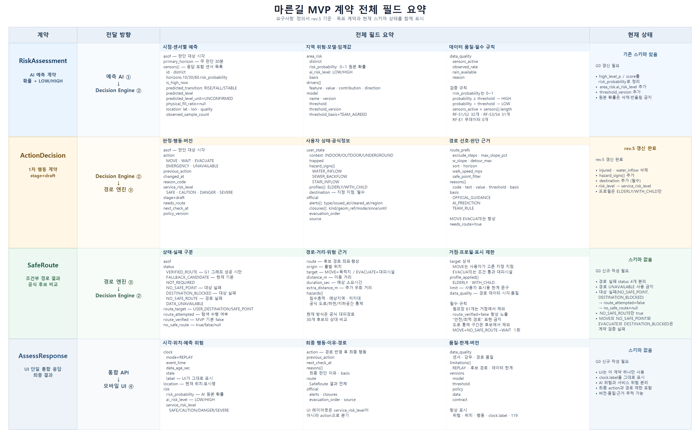

# 마른길 요구사항 정의서

> 문서 버전: rev.5 · 계약 명명·경로 실패 단계 정리본  
> 기준일: 2026-08-11  
> 요구 수준: MUST / SHOULD / COULD / WON'T  
> 상태: 목표 요구사항. 구현 완료를 의미하지 않는다.

## 1. 목적과 판정 원칙

이 문서는 각 기능에서 **사용자가 하는 일**과 **AI 또는 서비스가 하는 일**을 분리하고, 테스트 가능한 인수 조건을 정의한다. 해석이 다르면 [MVP 설계서](./마른길_MVP_설계서.md)의 공통 기준과 [문서 정합성 평가서](./마른길_문서_정합성_평가.md)의 결정을 따른다.

### 1.1 공통 enum

- 최종 서비스 위험 `ActionDecision.service_risk_level`: `SAFE`, `CAUTION`, `DANGER`, `SEVERE`
- AI 예측 위험 `RiskAssessment.area_risk.ai_risk_level`: `LOW`, `HIGH`
- 행동: `MOVE`, `WAIT`, `EVACUATE`, `EMERGENCY`, `UNAVAILABLE`
- 상황: `INDOOR`, `OUTDOOR`, `UNDERGROUND`
- 현장 위험 징후: `WATER_INFLOW`, `SEWER_BACKFLOW`, `STAIR_INFLOW`
- 프로필: `ELDERLY`, `WITH_CHILD` (`WHEELCHAIR`, `WITH_PET`은 데이터 부족으로 MVP 제외)
- 경로 상태: `VERIFIED_ROUTE`, `FALLBACK_CANDIDATE`, `NOT_REQUIRED`, `NO_SAFE_POINT`, `NO_SAFE_ROUTE`, `DESTINATION_BLOCKED`, `DATA_UNAVAILABLE`
- 경로 도달 대상: `USER_DESTINATION`(`MOVE`), `SAFE_POINT`(`EVACUATE`)
- 근거: `OFFICIAL_GUIDANCE`, `AI_PREDICTION`, `TEAM_RULE`

### 1.2 공통 판정 규칙

- `ActionDecision.service_risk_level`과 `action`은 별개다. 레이아웃은 `action`으로 분기한다.
- AI는 `RiskAssessment.area_risk.risk_probability`와 `ai_risk_level=LOW|HIGH`를 함께 반환한다.
- **두 위험 등급은 필드명으로 구분한다.** `ai_risk_level`은 팀 합의 임계값을 적용한 AI 이진 예측값이고, `service_risk_level`은 공식정보·AI·사용자 상태·품질을 종합한 최종 등급이다. 어느 계약에도 이름만 `risk_level`인 필드를 두지 않는다.
- AI는 최종 등급 `SEVERE`를 만들 수 없다.
- 공식 정보는 위험도의 하한이며 AI가 낮출 수 없다.
- 행동 판단 데이터가 부족하면 추측하지 않고 `WAIT` 또는 행동 `UNAVAILABLE`을 사용한다. 경로 판단 데이터가 부족한 경우에는 혼동 방지를 위해 `SafeRoute.status=DATA_UNAVAILABLE`을 사용한다.
- 기본 경로는 `route_verified=false`인 공식 대피경로 후보 비교다.
- 경로의 **도달 대상은 행동에 따라 다르다**. `MOVE`는 사용자가 입력한 목적지로 가는 경로를 찾고, `EVACUATE`는 서비스가 고른 안전거점으로 가는 경로를 찾는다. 후보 집합은 두 경우 모두 공식 대피경로 30개로 같다.
- 따라서 `NO_SAFE_POINT`는 안전거점을 탐색하는 `EVACUATE`에서만 발생한다. `MOVE` 응답에 `NO_SAFE_POINT`가 오면 계약 위반으로 처리한다.
- **목적지는 필수 입력이다.** 목적지 없이는 `MOVE`의 경로를 탐색할 수 없으므로 MVP는 목적지 미선택 상태를 두지 않는다. `MOVE`와 `EVACUATE`는 항상 `needs_route=true`다.
- 경로 실패는 **대상 단계**와 **경로 단계**로 나뉜다. 도달 대상을 확정하지 못하면 경로를 탐색하지 않으므로 `route_attempted=false`이고, 이때 `no_safe_route`는 경로 유무를 단정할 수 없어 항상 `null`이다.
- UI 시각은 `clock.label`을 그대로 사용한다.

## 2. 핵심 기능 상세

| ID | 우선순위 | 기능명 | 사용자 행동 | AI 또는 서비스가 하는 일 | 인수 조건 |
|---|---|---|---|---|---|
| F-01 | MUST | 10·30·60분 고수위 예측 | 재생 시점과 위치를 확인한다. | HistGradientBoosting이 활성 센서별 고수위 확률과 변화 방향을 산출하고, 30분 지역 `risk_probability`에 팀 합의 임계값을 적용해 `ai_risk_level=LOW\|HIGH`를 함께 반환한다. | 세 horizon 확률과 지역 `risk_probability`가 0~1이고 `asof`, 활성 센서 수, 관측률, 적용 임계값·버전이 포함된다. |
| F-02 | MUST | 현재 위험 등급 | 위치·상황을 확인한다. | 판단 엔진이 `ai_risk_level`과 공식·강우·하수·사용자 상태·품질을 결합해 `SAFE\|CAUTION\|DANGER\|SEVERE`를 결정한다. | AI `HIGH`만으로 `SEVERE`가 되지 않으며, `SEVERE`는 공식 정보가 있을 때만 가능하고 출처가 표시된다. |
| F-03 | MUST | 위험 근거 설명 | “왜 이런 판단인가”를 확인한다. | 공식/AI/팀 규칙별 핵심 이유를 우선순위로 최대 3개 제공한다. | 각 이유에 basis가 있고, UI는 3줄을 넘기지 않는다. |
| F-04 | MUST | 현재 장소·현장 위험 징후 입력 | `INDOOR`, `OUTDOOR`, `UNDERGROUND` 중 하나를 선택하고 지하에서는 물 유입·하수 역류·계단 유입 징후를 복수 선택한다. | 기본 장소를 `OUTDOOR`로 두고 징후를 `user_state.hazard_signs[]`로 전달한다. | `UNDERGROUND` + 징후 1개 이상이면 위험 계산 전 `EVACUATE`이며, 강우·하수 결측이나 범위 밖 상태가 이를 `UNAVAILABLE`로 덮지 않는다. 미선택은 `[]`다. |
| F-05 | MUST | 고립 신고 | 자력 이동이 불가능한 고립 상태를 직접 표시한다. | `trapped=true`이면 다른 신호보다 우선해 `EMERGENCY`를 반환한다. | 부상 입력은 제공하지 않으며 데이터 지연과 경로 결과가 `EMERGENCY`를 낮추지 않는다. |
| F-06 | MUST | 행동 권고 | 행동 카드와 재확인 시각을 본다. | 우선순위 정책으로 5개 행동 중 하나와 이유, `next_check_at`을 반환한다. | 첫 일치 규칙이 승리하고 계약 외 문자열이 나오지 않는다. |
| F-07 | MUST | 이동 프로필 | 고령자·아이 동반 중 하나 이상을 선택한다. | 선택값만 적용하고 저장·추론하지 않으며 안전 후보 내 순서를 조정한다. | `ELDERLY`, `WITH_CHILD`만 제공하고 미선택은 `[]`다. 프로필 때문에 안전 임계값이 낮아지지 않는다. |
| F-08 | MUST | 후보 경로 조회 | `MOVE` 또는 `EVACUATE` 행동에서 지도 후보를 본다. | 도달 대상을 `MOVE`는 사용자 목적지, `EVACUATE`는 안전거점으로 두고 공식 대피경로 30개 후보를 위험·통제·프로필로 상대 비교한다. | `route_target`이 `USER_DESTINATION\|SAFE_POINT`로 채워지고 `route_attempted=true`다. 기본 status는 `FALLBACK_CANDIDATE`, `route_verified=false`이며 제한 문구가 항상 보인다. |
| F-09 | MUST | 대피시설 추천 | `EVACUATE`에서 권고 시설과 이동 정보를 확인한다. | 대피시설 107개 중 범위·상태·프로필 조건에 맞는 시설을 안전거점으로 고른다. | 펌프장 61개를 시설 후보에 포함하지 않는다. 시설 근거와 데이터 시각을 표시한다. `MOVE`에서는 시설을 도달 대상으로 선택하지 않는다. |
| F-10 | MUST | 경로 실패 처리 | 경로 실패 사유와 현재 확정된 다음 행동을 본다. | 경로 엔진이 대상 단계 실패(`NO_SAFE_POINT`, `DESTINATION_BLOCKED`)와 경로 단계 실패(`NO_SAFE_ROUTE`), 판단 불가(`DATA_UNAVAILABLE`)를 구분해 반환하고 판단 엔진은 확정된 후처리만 한 번 적용한다. | 현재 확정된 전이는 `MOVE + NO_SAFE_ROUTE → WAIT`뿐이다. `NO_SAFE_POINT`는 `EVACUATE`에서만, `DESTINATION_BLOCKED`은 `MOVE`에서만 나온다. 대상 단계 실패는 `route_attempted=false`, `no_safe_route=null`이다. `EVACUATE` 경로 실패는 자동으로 `EMERGENCY`로 바꾸지 않고 별도 안전정책 확정 전까지 미결정으로 둔다. |
| F-11 | MUST | 지도 위험 근거 | 지도 레이어를 켜고 끈다. | 공식 통제, 예측 영역, 침수흔적, 시설, 후보 경로를 서로 다른 표현으로 렌더링한다. | 공식은 실선, 예측은 점선+라벨, 침수흔적은 기본 OFF다. 경로 레이어는 “추천 후보 경로”다. |
| F-12 | MUST | 재생 시계 | 상단의 재생 시각과 데이터 상태를 본다. | `clock.mode=REPLAY`, `event_time`, `data_age_sec`, `stale`, `label`을 응답한다. | UI가 `Date.now()`로 시간을 만들지 않고 `clock.label`을 그대로 표시한다. |
| F-13 | MUST | 데이터 지연·결측 처리 | 지연 안내와 보수적 행동을 확인한다. | 10분 초과 지연을 표시하고, 30분 초과 시 `MOVE→WAIT`, 관측률 70% 미만 시 `WAIT` 하한, 강우 결측 시 `UNAVAILABLE`을 적용한다. | 각 결과에 `TEAM_RULE` 근거가 붙고 `EMERGENCY`는 하향하지 않는다. |
| F-14 | MUST | 공식 정보 우선 | 공식 경보·대피 지시·도로 통제를 확인한다. | 공식 대피 지시는 `EVACUATE`를 결정하고, 도로 통제는 행동을 직접 바꾸지 않고 해당 구간을 경로 후보에서 제외한다. 그 밖의 공식 정보는 위험 하한과 판단 근거에 반영한다. | AI가 공식 등급을 낮추지 않는다. 공식 해제만으로 높은 AI 위험을 낮추지 않으며, 도로 통제만으로 `EVACUATE`를 반환하지 않는다. 내부 강우·하수 데이터 결측이 공식 대피 지시를 `UNAVAILABLE`로 덮지 않는다. |
| F-15 | MUST | 119 연결 | 고정 버튼을 눌러 전화하고 위치 문구를 복사한다. | 확인창 없이 `tel:119`를 호출하고 위치 문구를 제공한다. | 자동 신고·자동 위치 전송이라고 표현하지 않는다. `EMERGENCY`일 때 버튼이 확대된다. |
| F-16 | MUST | 모바일 단일 화면 | 한 화면에서 위험·행동·이유·지도·119를 확인한다. | 정해진 순서로 컴포넌트를 렌더링하고 action에 따라 필요한 블록만 바꾼다. | 위험, 위치, 행동, 시각, 119가 항상 보이고 조건부 블록은 3개 이하다. |
| F-17 | MUST | 범위 밖·동시각 단절 | 위치가 범위 밖이거나 필수 데이터가 없는 경우 안내를 본다. | 우선순위 1·2·4에 해당하지 않으면 추정하지 않고 행동 `UNAVAILABLE`과 원인을 반환한다. | `trapped=true`와 `UNDERGROUND`+`hazard_signs`는 데이터·범위 상태보다 우선한다. 공식 대피 지시는 내부 데이터 단절보다 우선하되 범위 밖에서는 적용하지 않는다. 그 외에는 행동을 “정보 없음”으로 표시하고 이동 경로를 생성하지 않는다. |
| F-18 | MUST | 버전·추적 정보 | 별도 조작 없음. | 모델·정책·데이터·계약 버전과 결정 근거를 응답 또는 비식별 로그에 남긴다. | 동일 픽스처·버전의 결과가 재현되고 개인 프로필은 저장하지 않는다. |
| F-19 | MUST | 목적지 입력 | 경로 범위 안의 지정 지점 목록에서 가려던 목적지를 **반드시 하나** 고른다. | 선택값을 `user_state.destination`으로 전달하고 `MOVE`의 도달 대상으로만 사용한다. 저장하지 않는다. | 목적지는 필수이며 `null`은 계약 검증에 실패한다. 목적지는 `EVACUATE`의 안전거점 선택에 영향을 주지 않는다. 목적지 선택 전에도 119 버튼은 항상 보인다. |

## 3. 행동 결정 상세

규칙은 위에서 아래로 평가하며 첫 일치가 최종값이다.

| 순위 | 조건 | 결과 | 근거 |
|---:|---|---|---|
| 1 | `trapped=true` | `EMERGENCY` | 사용자 자가신고 |
| 2 | `UNDERGROUND` + `hazard_signs` 1개 이상 | `EVACUATE` | 사용자 자가신고 + 팀 규칙 |
| 3 | 범위 밖 | `UNAVAILABLE` | 서비스 범위 |
| 4 | 공식 대피 지시 | `EVACUATE` | `OFFICIAL_GUIDANCE` |
| 5 | 같은 재생 시각의 필수 데이터 단절 | `UNAVAILABLE` | 데이터 계약 |
| 6 | `ai_risk_level=HIGH` + `OUTDOOR` | `EVACUATE` | `AI_PREDICTION` + 사용자 상황 |
| 7 | `ai_risk_level=HIGH` + `INDOOR` | `WAIT` | `AI_PREDICTION` + 사용자 상황 |
| 8 | `ai_risk_level=HIGH` + `UNDERGROUND` + `hazard_signs=[]` | `WAIT` | `AI_PREDICTION` + 사용자 상황 |
| 9 | 강우 기준값 초과(TH-01·TH-02) 또는 품질 하향 조건 충족 | `WAIT` | `TEAM_RULE` |
| 10 | 위 조건 없음 | `MOVE` | 정책 기본값 |

순서의 근거는 **각 규칙이 무엇에 의존하는가**다.

| 계층 | 규칙 | 의존 대상 | 데이터 단절에 영향받나 |
|---|---|---|---|
| 자기신고 | 1, 2 | 사용자 입력만 | **아니오.** 규칙 안에서 판정이 완결된다 |
| 서비스 범위 | 3 | 위치 | 아니오. 지역 정보 자체가 적용 대상이 아니다 |
| 공식 정보 | 4 | 공식 픽스처 | **아니오.** 강우·하수와 독립된 소스다 |
| 내부 데이터 | 5~10 | 강우·하수·AI | 예. 근거가 사라지면 판단할 수 없다 |

`trapped`와 `hazard_signs`는 강우·하수·AI를 참조하지 않으므로 그 데이터가 없어도 판정이 성립한다. 지하에서 물이 들어온다고 신고한 사용자에게 강우 데이터가 없다는 이유로 “정보 없음”을 돌려주지 않는다.

공식 대피 지시도 같은 이유로 내부 데이터 단절보다 위다. `UNAVAILABLE`은 “판단할 정보가 없다”는 뜻인데 공식 대피 지시가 있는 상태는 가장 권위 있는 정보가 있는 상태이므로, 이를 “정보 없음”으로 표시하면 F-14의 공식 정보 우선 원칙과 어긋난다.

다만 공식 대피 지시는 **지역에 매인 정보**이므로 범위 밖(3)보다는 아래다. 서비스 범위 밖 사용자에게는 이 지역의 대피 지시가 적용되지 않는다. 반면 자기신고(1, 2)는 사용자의 물리적 상황이므로 위치와 무관하게 유효하다.

범위 밖이면서 `hazard_signs`가 있으면 행동은 `EVACUATE`지만 경로 범위를 벗어나므로 `SafeRoute.status=DATA_UNAVAILABLE`이 된다. 행동은 알려주되 경로는 만들지 않는다.

도로 통제는 위 행동 분기 조건이 아니다. 경로 엔진이 후보를 비교하기 전에 통제 구간을 제외하며, 그 결과는 아래 경로 실패 상태 중 하나로 반환한다.

### 3.1 경로 결과 후처리

경로 실패의 의미는 도달 대상에 따라 달라지므로 `SafeRoute.route_target`과 함께 해석한다. 실패 단계는 `route_attempted`로 구분한다.

| 1차 행동 | 도달 대상 | `SafeRoute.status` | 실패 단계 | 최종 처리 | 합의 상태 |
|---|---|---|---|---|---|
| `MOVE` | `USER_DESTINATION` | `NO_SAFE_ROUTE` | 경로 | `WAIT` | 확정 |
| `MOVE` | `USER_DESTINATION` | `DESTINATION_BLOCKED` | 대상 | 자동 전이하지 않음. 목적지 변경 안내와 안전정책 필요 | 미결정 |
| `MOVE` | `USER_DESTINATION` | `DATA_UNAVAILABLE` | 판단 불가 | 자동 전이하지 않음. 안전정책 필요 | 미결정 |
| `MOVE` | — | `NO_SAFE_POINT` | — | 발생하지 않음. 계약 검증 실패로 처리 | 확정 |
| `EVACUATE` | `SAFE_POINT` | `NO_SAFE_POINT` | 대상 | 자동 전이하지 않음. 별도 안전정책 필요 | 미결정 |
| `EVACUATE` | `SAFE_POINT` | `NO_SAFE_ROUTE`, `DATA_UNAVAILABLE` | 경로 / 판단 불가 | 자동 전이하지 않음. 별도 안전정책 필요 | 미결정 |
| `EVACUATE` | — | `DESTINATION_BLOCKED` | — | 발생하지 않음. 안전거점은 안전 조건을 통과한 후보만 고르므로 계약 검증 실패로 처리 | 확정 |

후처리는 정확히 한 번만 수행하고 경로 엔진을 재호출하지 않는다. 특히 `EVACUATE` 경로 실패를 `EMERGENCY`로 자동 변환하는 규칙은 현재 합의에 포함하지 않는다.

### 3.2 데이터 품질 규칙

| ID | 조건 | 요구 결과 |
|---|---|---|
| DQ-01 | `data_age > 10분` | 현재 행동 유지, 지연 라벨 표시 |
| DQ-02 | `data_age > 30분`이고 행동이 `MOVE` | `WAIT`로 하향 |
| DQ-03 | 센서 관측률 `<70%` | 최소 `WAIT` |
| DQ-04 | 강우 데이터 결측 | `UNAVAILABLE`. 단 우선순위 1·2·4로 확정된 행동은 유지 |
| DQ-05 | 현재 행동이 `EMERGENCY`이거나 우선순위 2·4로 확정된 `EVACUATE` | 품질 사유로 하향 금지 |

위 임계값은 공식 재난 기준이 아니라 MVP 팀 규칙이므로 화면과 계약 근거에 `TEAM_RULE`을 표시한다.

### 3.3 행동 판정 기준값

우선순위 6~9가 쓰는 구체적 수치다. 모든 값은 2022 강남·서초 재생 데이터에서 산출한 내부 기준이며 공식 재난 기준이 아니다.

| ID | 신호 | 기준값 | 쓰이는 곳 | 근거 | 상태 |
|---|---|---|---|---|---|
| TH-01 | 10분 강우 | `≥ 5mm` | 규칙 9 → `WAIT` | 강우 관측행의 상위 8.6%(p90=4.0, p95=7.0). 8/8에서 19:30 발화로 TH-02보다 30분 선행 | 확정 |
| TH-02 | 60분 누적 강우 | `≥ 40mm` | 규칙 9 → `WAIT` | 45개 사건 중 6개에서 발화. 초안 55mm는 2개 사건만 발화하고 54.0mm 사건이 1mm 차로 빠져 경계가 취약 | 확정 |
| TH-03 | 센서 t+30 고수위 확률 | `≥ 0.33` → `HIGH` | `ai_risk_level` 산출 | val 사건에서 오경보 예산 0.05로 튜닝. val 재현율 0.793·오경보 0.047, test 0.648·0.029 | 센서 단위 확정 |
| TH-04 | 지역 집계 규칙 | **미확정** | `area_risk` → 규칙 6~8 | 현재 “센서 상위 25% 평균”은 검증된 적 없음 | **G2 확정 대상** |
| TH-05 | 하수 고수위 | 센서별 사건창 학습분할 p95 | AI 학습 타깃 | 학습 사건 관측행에서만 산출(누출 방지) | 행동 규칙에 직접 쓰지 않음 |

적용 규칙:

- TH-01과 TH-02는 **OR**로 묶는다. TH-01만으로는 약하게 오래 오는 비를 놓친다. 8/8 18:00~18:30은 10분 강우가 1.5~3.5mm라 TH-01에 걸리지 않지만 60분 누적은 이미 27~33mm였다.
- **강우 기준값이 만드는 결과는 `WAIT`까지다.** 강우량만으로 `EVACUATE`를 반환하지 않는다. 강우 기반 대피 지시의 국내 공식 기준이 확인되지 않았으므로 팀 규칙으로 대피를 지시하지 않는다(F-14).
- TH-05는 AI가 예측할 대상이며 이미 `ai_risk_level`을 통해 규칙 6~8에 반영된다. 규칙 9에서 하수를 다시 세지 않는다.
- **배수 신호는 사용하지 않는다.** 모델링 데이터셋 61개 컬럼이 전부 강우·하수 수위이고 배수·펌프 관련 피처가 없어 기준값을 정할 근거가 없다. 펌프장 61개는 시설 목록일 뿐 운영 데이터가 아니다.
- TH-05의 고수위 판정에는 히스테리시스를 적용한다. 측정 분해능이 0.01이라 임계를 그대로 `>=` 비교하면 임계 근처 센서가 재생 시각마다 상태를 뒤집는다. 올라갈 때 `p95 + 0.05`, 내려갈 때 `p95 - 0.05`를 쓴다.

TH-04가 미확정인 이유는 TH-03이 **센서 단위**로만 검증됐기 때문이다. 현재 집계식은 회복 국면을 따라가지 못한다 — 데모 픽스처에서 피크 `RF-S3`가 0.9995인데 회복 `RF-S4`도 0.964로 거의 같다. 같은 시점에 `0.33`을 넘는 센서 비율은 97%에서 55%로 내려간다. 집계 규칙을 먼저 정하고 지역 단위 임계를 따로 튜닝한다.

## 4. 프로필 상세

| ID | 프로필 | 사용자 행동 | 서비스 처리 | 인수 조건 |
|---|---|---|---|---|
| P1 | `ELDERLY` | 고령자 동행을 선택한다. | 가까운 대피시설과 60분 위험을 우선하며 우회 상한 초안 1.15를 적용한다. | 안전 후보 집합은 그대로이고 후보 순서만 달라진다. |
| P2 | `WITH_CHILD` | 아이 동반을 선택한다. | 30분 위험과 완만한 경사를 우선하며 경사 가중치 초안 1.5, 무가중 구간 5%를 적용한다. | 최소 수용 범위로 통합 테스트한다. |
| P-MULTI | 복수 프로필 | 고령자와 아이 동반을 함께 선택한다. | 두 조건의 교집합으로 후보를 필터링하고 안전 후보 내에서 순위를 정한다. | 후보가 없을 때 `EVACUATE`는 실패 원인에 따라 `NO_SAFE_POINT` 또는 `NO_SAFE_ROUTE`를, `MOVE`는 `NO_SAFE_ROUTE`만 반환하고 F-10의 확정된 후처리만 적용한다. |

프로필 값은 G2까지 초안이며 기획 PM이 한 번 동결한다.

### 4.1 MVP 제외 프로필

| 프로필 | 제외 사유 | 시스템 처리 |
|---|---|---|
| `WHEELCHAIR` | 계단·경사·접근성 검증 데이터 부족 | UI 선택지와 계약 enum에서 제외 |
| `WITH_PET` | 대피시설별 반려동물 동반 가능 여부 검증 데이터 부족 | UI 선택지와 계약 enum에서 제외 |

## 5. 경로·시설 요구사항

| ID | 요구사항 | 검증 방법 |
|---|---|---|
| RT-01 | 현재 기본은 공식 대피경로 30개 후보 비교다. 도달 대상이 목적지든 안전거점이든 후보 집합은 같다. | 응답 `status=FALLBACK_CANDIDATE` 확인 |
| RT-02 | `route_verified=false`와 제한 문구를 항상 노출한다. | UI 스냅샷·계약 테스트 |
| RT-03 | “안전”, “최적”, “검증 완료” 경로 표현을 쓰지 않는다. | 문구 정적 검사 |
| RT-04 | 경로 범위는 강남역 반경 0.5~1km이며 G1에 포함 센서 수를 기록한다. | 범위 보고서 |
| RT-05 | exact/road 좌표도 수동 확인 후에만 차단 근거로 사용한다. | 좌표 provenance 검사 |
| RT-06 | landmark/road-name/unmatched 좌표는 시각화에만 사용한다. | 라우팅 입력 검사 |
| RT-07 | 펌프장 61개를 대피시설로 사용하지 않는다. | 시설 타입 테스트 |
| RT-08 | G1에서 그래프 조회를 한 번만 판단하고 실패 시 후보 방식으로 고정한다. | 결정 기록 |
| RT-09 | 경로 실패 상태는 `NO_SAFE_POINT`, `NO_SAFE_ROUTE`, `DESTINATION_BLOCKED`, `DATA_UNAVAILABLE`로 구분하고 경로 상태에 `UNAVAILABLE`을 사용하지 않는다. | 계약 enum 테스트 |
| RT-09b | `no_safe_route=true`는 `route_attempted=true`인 경우에만 허용한다. 대상 단계 실패는 `route_attempted=false`, `no_safe_route=null`이다. | 계약 검증 테스트 |
| RT-10 | `MOVE + USER_DESTINATION + NO_SAFE_ROUTE → WAIT` 후처리는 정확히 한 번만 수행하며 경로 엔진을 재호출하지 않는다. | 통합 테스트 |
| RT-11 | 공식 도로 통제 구간은 후보 비교 전에 제외하며 도로 통제 자체로 행동을 `EVACUATE`로 바꾸지 않는다. | 정책·경로 통합 테스트 |
| RT-12 | 모든 경로 응답은 `route_target`을 채운다. `MOVE`는 `USER_DESTINATION`, `EVACUATE`는 `SAFE_POINT`이며 교차하지 않는다. | 계약 enum 테스트 |
| RT-13 | `MOVE` 응답의 `NO_SAFE_POINT`와 `EVACUATE` 응답의 `DESTINATION_BLOCKED`은 계약 검증에 실패한다. | 계약 enum 테스트 |
| RT-14 | 목적지는 경로 범위 안의 지정 지점 목록에서만 **필수로** 선택한다. 자유 좌표 입력은 RT-08의 그래프 채택에 성공한 경우에만 허용한다. | 입력 검증·결정 기록 |
| RT-15 | 경로 범위 밖 목적지는 `DATA_UNAVAILABLE`로 반환하고 UI는 입력 단계에서 선택지를 제공하지 않는다. | 범위 검증 테스트 |
| RT-16 | `MOVE`의 최선 후보가 목적지에 정확히 닿지 않으면 `FALLBACK_CANDIDATE`를 유지하고 “목적지 인근 후보”로 표기한다. 목적지 도달을 단정하지 않는다. | 문구 정적 검사·UI 스냅샷 |
| RT-17 | 목적지 차단 여부는 목록 등재가 아니라 재생 시각별 **공식 통제·확인된 침수**로 판정한다. AI 예측 확률만으로 목적지를 차단하지 않으며 목록 등재를 안전 보장으로 표시하지 않는다. | 시각별 판정 테스트·문구 검사 |

### 5.1 SafeRoute 필수 필드

- `status`, `route_verified`
- `route_target`: `USER_DESTINATION` 또는 `SAFE_POINT`. 경로가 필요 없으면 `null`
- `target`: 실제 도달 대상. `MOVE`는 사용자가 고른 목적지 지점, `EVACUATE`는 선택된 대피시설
- `route_attempted`: 경로 탐색을 실제로 수행했는지
- 경로 거리·예상 시간·추가 우회 정보
- 위험·통제 근거와 `hazards`
- `profile_applied`
- `no_safe_route`
- 사용자 표시용 `limit`

경로 결과는 **어느 단계에서 끝났는지**로 나뉜다. 도달 대상을 확정하지 못하면 경로 탐색 자체를 시작하지 않으므로 경로의 존재 여부를 단정할 수 없다.

| `SafeRoute.status` | 의미 | 발생 가능 행동 | 실패 단계 | `route_attempted` | `no_safe_route` |
|---|---|---|---|---|---|
| `VERIFIED_ROUTE` | 검증 기준을 충족한 경로 | `MOVE`, `EVACUATE` | — | `true` | `false` |
| `FALLBACK_CANDIDATE` | 공식 경로 후보 상대 비교. 기본값 | `MOVE`, `EVACUATE` | — | `true` | `false` |
| `NOT_REQUIRED` | 행동상 경로가 필요하지 않음 | `WAIT`, `EMERGENCY`, `UNAVAILABLE` | — | `false` | `null` |
| `NO_SAFE_POINT` | 조건을 만족하는 안전거점 후보가 없어 탐색에 들어가지 못함 | `EVACUATE`만 | 대상 | `false` | `null` |
| `DESTINATION_BLOCKED` | 고른 목적지가 공식 통제 또는 확인된 침수로 이동 대상에서 제외됨 | `MOVE`만 | 대상 | `false` | `null` |
| `NO_SAFE_ROUTE` | 대상까지 탐색했으나 통제·위험·프로필 조건으로 모든 후보 경로가 제외됨 | `MOVE`, `EVACUATE` | 경로 | `true` | `true` |
| `DATA_UNAVAILABLE` | 데이터 누락·미연결·경로 범위 밖으로 경로 존재 여부를 판단할 수 없음 | `MOVE`, `EVACUATE` | 판단 불가 | `false` | `null` |

**`no_safe_route=true`는 `route_attempted=true`일 때만 나온다.** 탐색하지 않은 상태에서 “안전한 경로가 없다”고 단정할 수 없기 때문이다. `NO_SAFE_POINT`와 `DESTINATION_BLOCKED`은 경로가 실제로 존재할 수도 있지만 도달 대상이 성립하지 않아 제시하지 않는 것이므로 `null`이다.

두 대상 단계 실패는 행동별로 대칭이다. 안전거점 탐색은 `EVACUATE`에만 있으므로 “대상이 없음”인 `NO_SAFE_POINT`도 `EVACUATE` 전용이다. `MOVE`의 대상은 사용자가 이미 지정했으므로 대상이 없을 수 없고, 대신 그 대상이 제외될 수는 있으므로 `DESTINATION_BLOCKED`이 `MOVE` 전용이다. 안전거점은 안전 조건을 통과한 후보만 고르므로 `EVACUATE`에서 `DESTINATION_BLOCKED`은 나오지 않는다.

`DESTINATION_BLOCKED`은 사용자가 잘못된 곳을 입력했다는 뜻이 아니다. MVP는 자유 좌표 입력을 받지 않으므로 목적지는 항상 유효한 지정 지점이며, **지정 지점 목록에 있다는 사실이 안전을 보장하지 않는다**. 목록은 “경로 범위 안에서 목적지로 고를 수 있는 지점”일 뿐이고, 차단 여부는 재생 시각마다 다시 판정한다. 같은 지점이 20:00에는 정상이고 20:40에는 `DESTINATION_BLOCKED`일 수 있다.

**차단 근거는 공식 도로·구역 통제와 확인된 침수로 한정한다.** AI 예측 확률만으로는 목적지를 차단하지 않는다. 예측을 근거로 이동을 막으면 AI-08(하수 고수위를 도로 침수로 단정 금지)과 RT-05(수동 확인한 좌표만 차단 근거)에 어긋나기 때문이다. 목적지 인근의 예측 위험은 차단이 아니라 후보 경로 비교와 판단 근거에 반영한다.

`DATA_UNAVAILABLE`은 경로 계약의 상태이며 행동 `UNAVAILABLE`과 다른 값이다.

## 6. 데이터·AI 요구사항

| ID | 요구사항 | 인수 조건 |
|---|---|---|
| AI-01 | 하수 원본을 과거 명목상 1분 간격 데이터로 취급한다. | “실시간 1분 관측”이라는 문구가 산출물에 없다. 통신두절 누락이 명시된다. |
| AI-02 | 모델 입력은 10분 집계·완전격자·품질검사 결과다. | 피처 생성 전에 시각 정렬·품질 필드가 존재한다. |
| AI-03 | 센서 레지스트리는 35개지만 응답은 해당 과거 재생 시점에 데이터·품질 조건을 충족한 센서만 포함한다. | `RF-S1/S2`는 32개, `RF-S3/S4`는 31개, 무데이터 `RF-E1`은 0개로 스키마를 통과하며 `data_quality.sensors_active`가 실제 배열 길이와 일치한다. |
| AI-04 | 선택 모델은 HistGradientBoosting이며 센서 단위 임계값은 0.33이다(TH-03). 지역 단위 `ai_risk_level` 임계는 TH-04 집계 규칙 확정 후 별도로 정한다. | Predictor 코드에 임계값을 임의 하드코딩하지 않고 `threshold`, `threshold_version`, `threshold_basis=TEAM_AGREED`를 기록한다. |
| AI-05 | 모델 평가는 이벤트 단위 분할을 사용한다. | 38/4/3 분할과 2022-08-08 테스트 홀드아웃이 재현된다. |
| AI-06 | 대표 지표는 상승 재현율 0.648, 오경보율 0.029, 사전 감지율 85.3%다. | 발표·문서가 Logistic의 87.7%를 선택 모델 성능으로 쓰지 않는다. |
| AI-07 | 단위와 관경 미확인 상태를 보존한다. | `predicted_level_unit=UNCONFIRMED`, `physical_fill_ratio=null` |
| AI-08 | 하수 고수위를 도로 침수로 단정하지 않는다. | UI·발표 문구 검사 |
| AI-09 | 예측 AI는 확률과 이진 예측 등급을 함께 반환한다. | `ai_risk_level=HIGH` iff `risk_probability >= threshold`, 그 외 `LOW`; 원본 확률을 반올림·삭제하지 않는다. |
| AI-10 | AI 이진 등급과 최종 서비스 위험 등급을 분리한다. | `RiskAssessment.area_risk.ai_risk_level`은 `LOW\|HIGH`, `ActionDecision.service_risk_level`은 `SAFE\|CAUTION\|DANGER\|SEVERE`만 허용한다. 두 계약 모두 이름이 `risk_level`인 필드를 두지 않는다. |

## 7. 계약 요구사항

| ID | 계약 | 요구사항 | 현재 상태 |
|---|---|---|---|
| CT-01 | `RiskAssessment` | ①→②, 센서별 확률·변화·품질과 30분 지역 `risk_probability`, `ai_risk_level`, 임계값 버전 전달 | 기존 스키마 갱신 필요 |
| CT-02 | `ActionDecision` | ②→③, action·`service_risk_level`·needs_route·이유·`trapped`·`hazard_signs`·`destination` 전달 | 갱신 완료 |
| CT-03 | `SafeRoute` | ③→②, `route_target`·`target`·`route_attempted`·경로 상태·후보·제한과 `NO_SAFE_POINT\|NO_SAFE_ROUTE\|DESTINATION_BLOCKED\|DATA_UNAVAILABLE` 실패 상태 전달 | G0 작성 필요 |
| CT-04 | `AssessResponse` | API→④, clock·위험·행동·경로·품질을 통합 | G0 작성 필요 |
| CT-05 | 공식정보 픽스처 | 2022-08-08 공식 경보·통제와 출처·시각 제공 | G0 작성 필요 |

추가 제약:

- `ActionDecision.needs_route=true`는 `MOVE`, `EVACUATE`에만 허용하며, 두 행동에서는 항상 `true`다.
- `ActionDecision.user_state.destination`은 지정 지점 목록의 식별자·좌표·표시명이며 **필수**다. `null`은 계약 검증에 실패한다. 저장하거나 다른 정보에서 추론하지 않는다.
- `SafeRoute.route_target`은 `action=MOVE`면 `USER_DESTINATION`, `action=EVACUATE`면 `SAFE_POINT`이고 그 외에는 `null`이다.
- `SafeRoute.status`에는 행동 상태인 `UNAVAILABLE`을 사용하지 않고 경로 데이터 단절은 `DATA_UNAVAILABLE`로 반환한다.
- 계약에 없는 `UNKNOWN`, `EMERGENCY_ASSIST`, `AVAILABLE`, `WITHHELD`를 사용하지 않는다.
- 시간은 ISO 8601과 명시적 시간대를 사용한다.
- enum과 required 필드 변경은 G3 이후 금지한다.

## 8. UI 요구사항

| ID | 우선순위 | 요구사항 | 인수 조건 |
|---|---|---|---|
| UI-01 | MUST | 모바일 단일 페이지 | 로그인·설정·이력·온보딩 화면이 없다. |
| UI-02 | MUST | 상단 고정 영역 | 위험, 위치, `clock.label`이 스크롤과 무관하게 보인다. |
| UI-03 | MUST | 행동 카드 | 5개 행동 라벨과 이유를 계약 그대로 표시한다. |
| UI-04 | MUST | 119 고정 버튼 | 최소 48px, `tel:119`, EMERGENCY 시 확대 |
| UI-05 | MUST | 출처 시각 구분 | 공식은 실선, 예측은 점선과 문구로 구분한다. |
| UI-06 | MUST | 접근성 | 대비 4.5:1, 색 외 형태·텍스트, 상태 live region, reduced motion |
| UI-07 | MUST | 제한 고지 | 교육·시연용 및 경로 한계가 항상 보인다. |
| UI-08 | MUST | 오류 상태 | 로딩·지연·결측·범위 밖을 행동과 함께 명확히 표시한다. |
| UI-09 | SHOULD | 흑백 판독 | 흑백 스크린샷에서도 위험·행동·공식/예측이 구분된다. |
| UI-10 | MUST | 목적지 입력 | 경로 범위 내 지정 지점 목록에서 1개를 필수로 고른다. 자유 텍스트·자유 좌표 입력과 선택 해제를 제공하지 않는다. 선택 전에도 119 버튼과 면책 문구는 보인다. |
| UI-11 | MUST | 경로 대상 표기 | 지도와 경로 카드가 “목적지까지”(`MOVE`)와 “대피시설까지”(`EVACUATE`)를 다른 문구로 구분한다. |

## 9. 비기능 요구사항

| ID | 구분 | 목표 | 검증 |
|---|---|---|---|
| N-01 | 예측 성능 | 50ms 이하 | 고정 픽스처 반복 측정 |
| N-02 | 경로 성능 | 500ms 이하 | 30개 후보 최악 조건 측정 |
| N-03 | 초기 표시 | throttled 3G에서 3초 이하 | 브라우저 성능 프로필 |
| N-04 | 재현성 | 동일 입력·버전이면 동일 결과 | golden fixture 비교 |
| N-05 | 가용성 | 실패 시 추측 대신 명시 상태 | 오류 주입 테스트 |
| N-06 | 접근성 | 키보드·스크린리더·흑백 대응 | 자동 + 수동 검사 |
| N-07 | 개인정보 | 프로필·상황 비저장 | 네트워크·스토리지 검사 |
| N-08 | 추적성 | 모델·정책·데이터·계약 버전 기록 | 응답·로그 검사 |
| N-09 | 안전 문구 | 공식/AI/팀 규칙과 한계를 분리 | 문구 검수 |

## 10. 수용 시나리오

### 10.1 통합 데모

| ID | 입력 핵심 | 기대 결과 |
|---|---|---|
| DS-S1 | 평온, 데이터 정상 | `MOVE`, `route_target=USER_DESTINATION`, `route_attempted=true`, 목적지까지 후보 경로 |
| DS-S2 | 강우·위험 상승 | `WAIT`, 재확인 시각 |
| DS-S3 | 공식 대피 지시 또는 AI `HIGH` + 실외 | `EVACUATE`, `route_target=SAFE_POINT`, 시설·후보 표시 |
| DS-S4 | `trapped=true` | `EMERGENCY`, 119 확대 |
| DS-S5 | `MOVE` + 목적지까지 모든 후보 경로 제외 | `NO_SAFE_ROUTE`, `route_attempted=true`, `no_safe_route=true`, 최종 `WAIT`; 후처리 1회 |
| DS-S6 | `MOVE` + 목적지가 공식 통제 구간에 포함 | `DESTINATION_BLOCKED`, `route_attempted=false`, `no_safe_route=null`; 목적지 변경 안내 |
| E1 | 범위 밖 또는 동시각 데이터 단절 | `UNAVAILABLE` |
| X1 | `WHEELCHAIR` 또는 `WITH_PET` payload | 계약 검증 실패; UI에는 선택지 없음 |
| R1 | 지하 + 현장 위험 징후 1개 이상 | 위험 계산 전 `EVACUATE` |
| R2 | AI `HIGH` + 실내 | `WAIT` |
| R3 | 도로 통제 + AI `LOW` | 통제 구간 제외, 행동은 다른 우선순위 규칙으로 결정 |
| R4 | 지연 30분 초과 + 기존 MOVE | `WAIT` |
| R5 | 범위 밖 또는 필수 데이터 단절 + `trapped=true` | `EMERGENCY` |
| R5-b | 필수 데이터 단절 + 지하 + 현장 위험 징후 1개 이상 | `EVACUATE`. `UNAVAILABLE`로 덮지 않음 |
| R5-c | 강우 데이터 결측 + 공식 대피 지시 | `EVACUATE`. `UNAVAILABLE`로 덮지 않음 |
| R5-d | 범위 밖 + 공식 대피 지시, 자가신고 없음 | `UNAVAILABLE`. 지역 대피 지시를 범위 밖에 적용하지 않음 |
| R5-e | 범위 밖 + 지하 + 현장 위험 징후 1개 이상 | `EVACUATE` + `SafeRoute.status=DATA_UNAVAILABLE` |
| R6 | AI `HIGH` + 실외 | `EVACUATE` |
| R7 | AI `HIGH` + 지하 + 현장 위험 징후 없음 | `WAIT` |
| R8 | 공식 대피 지시 + AI `LOW` | `EVACUATE` |
| R9 | `MOVE` + 고른 목적지가 해당 재생 시각에 공식 통제·확인된 침수로 제외됨 | `DESTINATION_BLOCKED`, `route_attempted=false`, `no_safe_route=null`; 목적지 변경 안내 |
| R9-b | 같은 목적지, 통제가 걸리기 이전 재생 시각 | `FALLBACK_CANDIDATE`; 동일 지점이 시각에 따라 다르게 판정됨 |
| R9-c | `MOVE` + 목적지 인근 AI `HIGH`, 공식 통제·확인된 침수 없음 | 차단하지 않음. 정상 경로 탐색 후 위험을 근거로만 표시 |
| R10 | `EVACUATE` + 조건 충족 안전거점 0개 | `NO_SAFE_POINT`; 자동 전이 없음 |
| R11 | `MOVE` 응답에 `NO_SAFE_POINT` 또는 `EVACUATE` 응답에 `DESTINATION_BLOCKED` payload | 계약 검증 실패 |
| R12 | `route_attempted=false`인데 `no_safe_route=true`인 payload | 계약 검증 실패 |
| R13 | `user_state.destination=null` payload | 계약 검증 실패 |
| R14 | 10분 강우 4.0mm + 60분 누적 45mm | `WAIT`. TH-02 단독 발화로 TH-01·TH-02가 OR임을 확인 |
| R15 | 60분 누적 130mm, 자기신고·공식 지시 없음, AI `LOW` | `WAIT`. 강우만으로 `EVACUATE`가 되지 않음 |

### 10.2 모델 픽스처

기존 `risk_S1_*`~`risk_S4_*`, `E1_no_data` 파일은 각각 `RF-S1`~`RF-S4`, `RF-E1`로 부른다. 통합 데모 `DS-S*`와 동일 이름으로 취급하지 않는다.

데모의 시각은 공식정보 픽스처가 확정할 때까지 하드코딩하지 않는다. UI는 항상 응답의 `clock.label`을 사용한다.

## 11. 게이트별 완료 조건

| 게이트 | 필수 결과 |
|---|---|
| G0 · T+1.5h | `SafeRoute`, `AssessResponse`, 공식정보 픽스처 완성; 4대 계약 예제 통과 |
| G1 · T+3h | 단일 화면 mock, 경로 범위 포함 센서 수, 좌표 근거, 그래프 채택 여부 기록 |
| G2 · T+10h | E2E 한 건 통과; P1/P2 값 동결; `EVACUATE` 경로 실패와 `MOVE + DESTINATION_BLOCKED`·`MOVE + DATA_UNAVAILABLE` 안전정책 확정; 목적지 차단 판정 기준 동결; **TH-04 지역 집계 규칙과 지역 단위 임계 확정**; TH-01~TH-03·TH-05 히스테리시스 동결 |
| T+12h | 일반 대피시설 상태·근거 태그 마감; 목적지 지정 지점 목록 확정 |
| G3 · T+21h | DS-S1~S6, P1/P2, E1, R1~R15(`R5-b`~`R5-e`, `R9-b`, `R9-c` 포함) 및 접근성 통과; 계약 동결 |
| T+24h | 전체 QA와 금칙어 검사 통과 |
| T+26h | 발표 리허설과 장애 복구 확인 |

## 12. 추적표

| 요구 그룹 | 설계서 절 | 주 검증 산출물 |
|---|---|---|
| F-01~03, AI-* | 8장 | 모델 평가표, `RiskAssessment` |
| F-04~07, F-19 | 5·6·9장 | `ActionDecision`, 정책 테스트 |
| F-08~11, RT-* | 10장 | `SafeRoute`, 지도 스냅샷 |
| F-12~18, UI-* | 11·12장 | `AssessResponse`, E2E |
| N-* | 14장 | 성능·접근성·재현성 보고서 |

## 13. 금지 범위

- 실시간 서비스로 표현하거나 현재 1분 관측을 주장하지 않는다.
- 공식 대피경로 후보를 안전·최적 경로로 단정하지 않는다.
- 목적지까지의 후보 경로를 도달 보장이나 내비게이션 안내로 표현하지 않는다.
- 자유 좌표·자유 텍스트 목적지 입력을 MVP 지원 기능처럼 표시하지 않는다.
- 하수 고수위 확률을 도로 침수 확정으로 표현하지 않는다.
- 단위 미확인 값을 m·cm·충만율로 변환하지 않는다.
- 프로필을 추론·저장하거나 안전 기준을 낮추지 않는다.
- `WHEELCHAIR`, `WITH_PET`을 MVP 지원 기능처럼 표시하지 않는다.
- 112, 자동 신고, 자동 위치 전송을 MVP 기능으로 넣지 않는다.
